# 4. Group Assignment - Computer controlled cutting

This week I worked on defining my final project idea and started to getting used to the documentation process.

## **Cardboard (Sarah Nadir)**

I was assigned to cut carboard and test the settings.

I chose `Natural` > `Paper` > `Cardboard 3mm`. However, upon measuring the cardboard, I found that it was around 3.6mm, so I changed the `material thickness` setting accordingly. I did a few trials with different powers, speed, and frequency, and all those trials are documented below.

| Power | Speed | Frequency |                                                                                       |
|-------|-------|-----------|---------------------------------------------------------------------------------------|
| 65%   | 27%   | 500       | Did not cut, rather formed sort of an engraving.                                      |
| 100%  | 20%   | 500       | Managed to cut, but did not achieve the drop-down test.                               |
| 100%  | 24%   | 500       | Managed to penetrate through all the layers, yet it was still stuck to the cardboard. |
| 100%  | 15%   | 500       | My favorite settings! It was a star at the drop-down test.                            |

>When the pieces cut fall out of the material without having to push them out, thats what I call a drop-down.

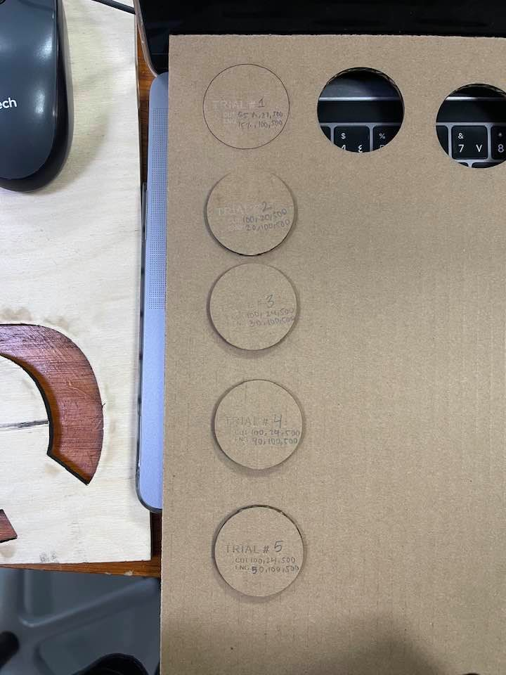

## **Cast Acrylic (Sara Alhadhrami)**

I tested the Transparent Cast Acrylic with a thickness of 2.7mm

I used a simple design to find out the best power and speed needed to be set in the
Laser Cutting Machine **(Universal Laser Systems Machine)** for cutting and engraving the 2.7mm Cast Acrylic.
In addition to measure and calculate the amount of the material that was burned during the cut, which called (Kerf).

First I cut using the default settings, then I did three trials to see the effect of changing speed and power of the laser machine on the material.

### **Default Settings**

| Type      |  Power  |  Speed  | PPL                                                                                |
|-----------|---------|---------|------------------------------------------------------------------------------------|
| Cut       | 100%    | 4.4%    | 1000                                                                               |
| Engraving | 26%     | 100%    | 500                                                                                |

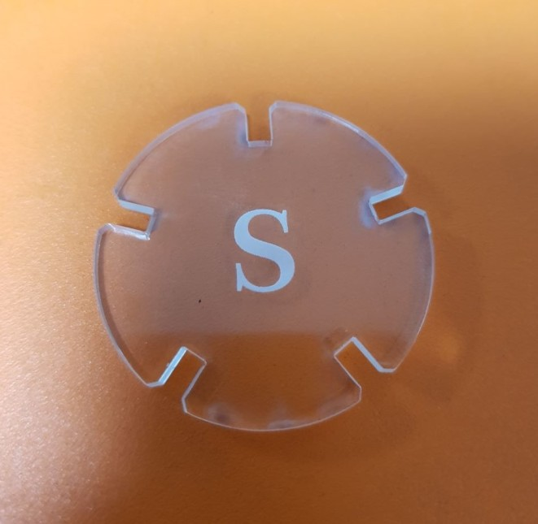{width="60%"}

### **First Trial**

In the first trial I reduced the Power to 80% for the cut and I increased it to 35% for engraving.
I liked the result of engraving but the cut caused more of the gray surface at the edges.

| Type      |  Power  |  Speed  | PPL                                                                                |
|-----------|---------|---------|------------------------------------------------------------------------------------|
| Cut       | 80%     | 4.4%    | 1000                                                                               |
| Engraving | 35%     | 100%    | 500                                                                                |

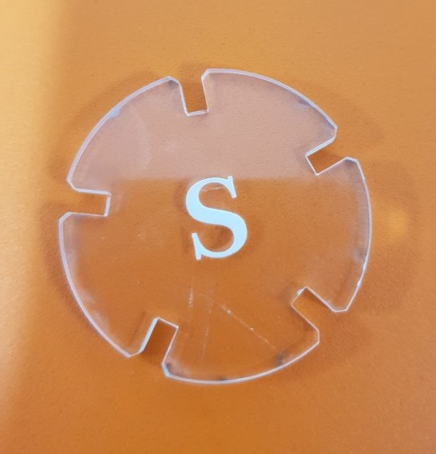{width="60%"}

### **Second Trial**

In the second trial I increased the speed of cutting to 10% and reduced the speed of engraving to 80%.
Engraving was good and it looks more white but the cut wasn't perfect, it was a little bit hard so separate it from the plate.

| Type      |  Power  |  Speed  | PPL                                                                                |
|-----------|---------|---------|------------------------------------------------------------------------------------|
| Cut       | 100%    | 10%     | 1000                                                                               |
| Engraving | 26%     | 80%     | 500                                                                                |

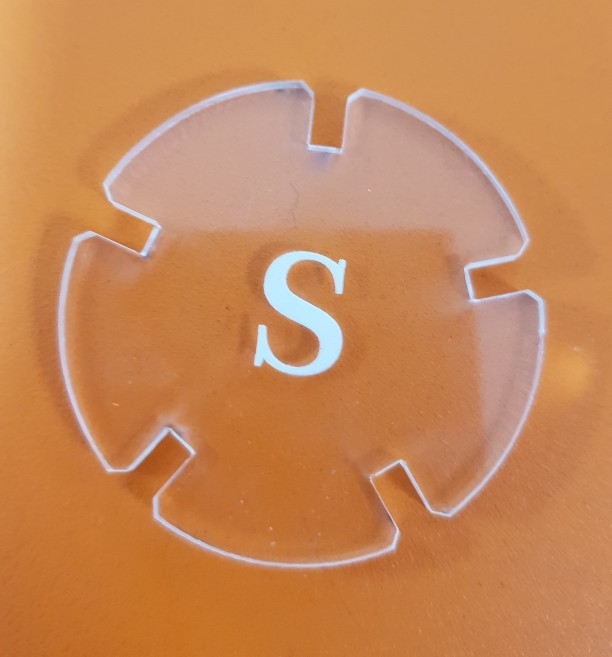{width="60%"}

### **Third Trial**

In the third trial, I increased the speed of cutting to 25% and decreased the speed of engraving to 50%. The result of engraving still nice but the speed of cutting was fast and didn't cut the material.

| Type      |  Power  |  Speed  | PPL                                                                                |
|-----------|---------|---------|------------------------------------------------------------------------------------|
| Cut       | 100%    | 25%     | 1000                                                                               |
| Engraving | 26%     | 50%     | 500                                                                                |

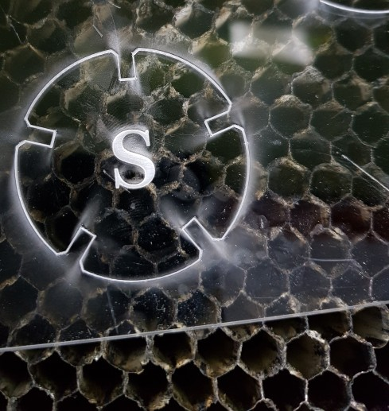{width="60%"}

### **Calculating Kerf (Cast Acrylic)**

Then I started designing a 60x30 mm rectangle to calculate the [kerf](https://www.instructables.com/How-to-Adjust-for-Wood-Thickness-and-Kerf-on-a-Las/). I divided into 12 equal rectangles with 5 mm width each. I did this step in Fusion360 by using the rectangular pattern tool.

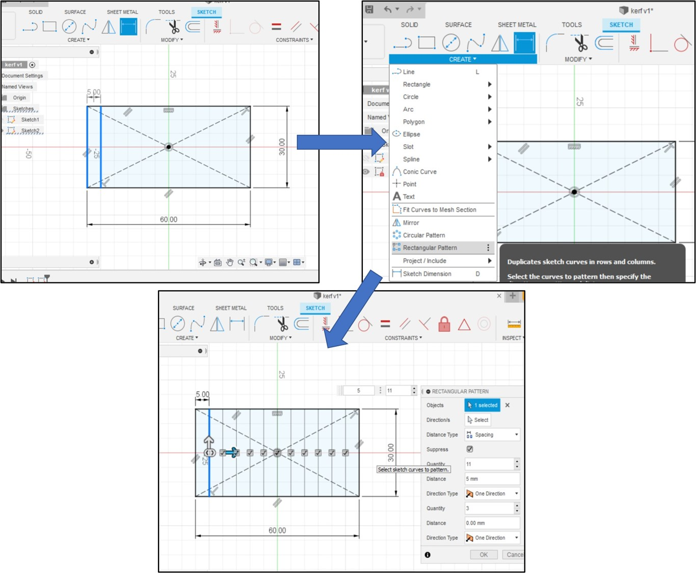

I saved the design as DXF file and I open it in **CorelDraw** software to cut it.

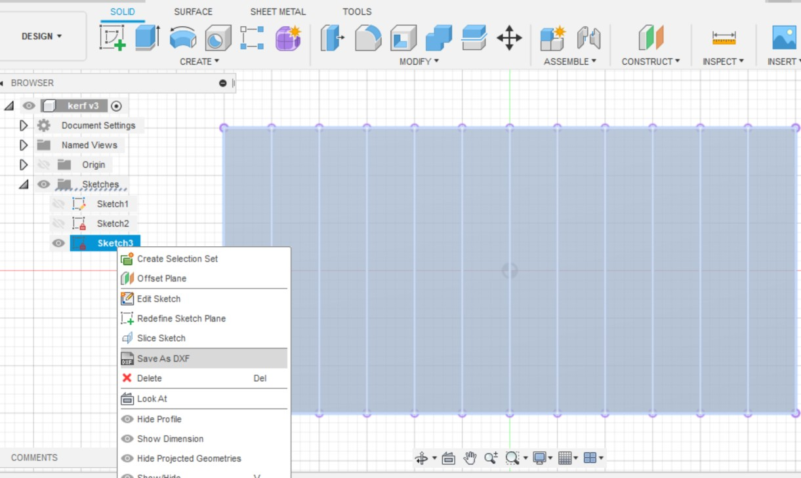{width="80%"}

After cut

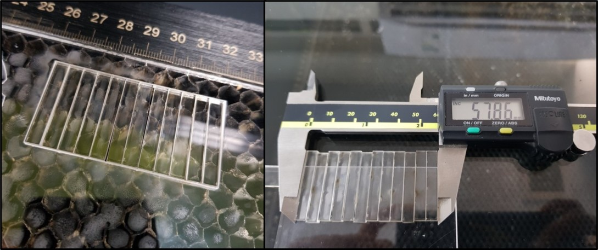
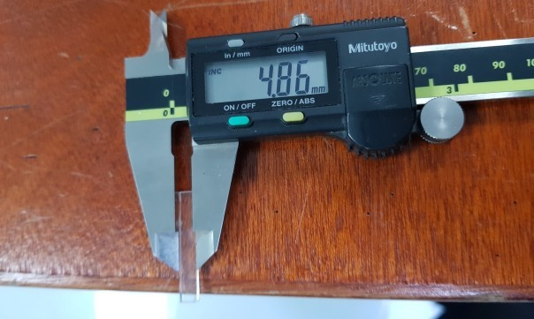{width="80%"}

And finally I used this equation to calculate the kerf
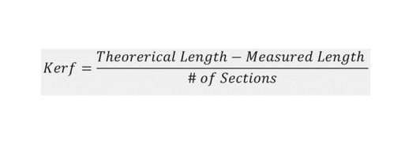{width="60%"}

Kerf= (60-57.86)/12= 0.17833mm

## **microsurface plastic (Ohood Walid)**

For the group assignment I selected red microsurface plastic 1.50mm & tested several cutting & engraving settings as shown below

**Cutting test**

| Power |  Speed  |  Frequency  | note                                                                           |
|-------|---------|-------------|--------------------------------------------------------------------------------|
| 100   | 2       | 2000Hz      | It didn’t cut the cardboard                                                    |
| 60    | 1       | 2000Hz      | The cardboard was cut all the way but it was still hard to remove              |
| 60    | 0.8     | 2000Hz      | The best settings so far                                                       |

**Engrave test**

| Power |  Speed  |  Frequency  | note                 |
|-------|---------|-------------|----------------------|
| 50    | 30      | 1000PPI     | Not neat             |
| 60    | 50      | 1000PPI     | Clear engraving      |

below a picture of the tests

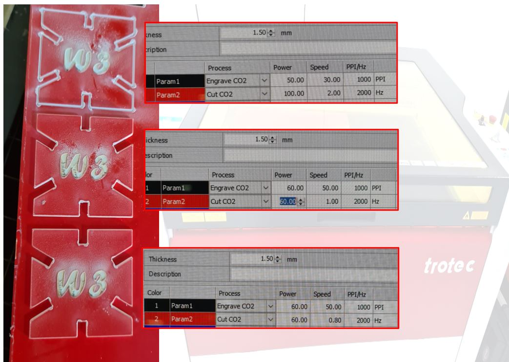{width="60%"}

**Kerf measurement**

Kerf is decided by material properties and thickness, the focal distance of the lens and therefore the gas used while cutting. you can use the following methods:

the average kerf for that material and material thickness is measure by Dividing the gap by 5. The result as following

1. to calculate the kerf draw a rectangle with length of 80mm by 40mm

2. divided it into 4 pieces

3. cut it with the laser cutter

4. measure the pieces together

5. then use the following equation: (Actual length - Measured length) / (Number of cuts+1)= Kerf.

Kerf = (80-78.45)/5= 0.31

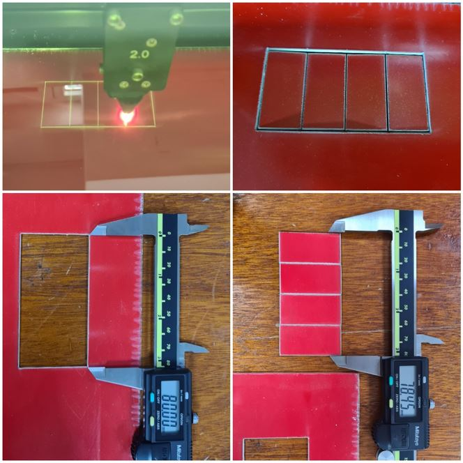{width="60%"}

the second method a straightforward test to measure the kerf by measured the gap then dividing by 5

Kerf = 1.53/5= 0.30

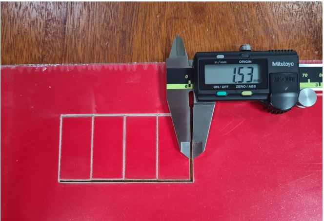{width="60%"}

## 6mm Acrylic Kerf Calculating (Mohammad Alsamsi) 

**Kerf** = **Width**

**Kerf** is defined as the width of material that is removed by a cutting process. It was originally used to describe how much wood was removed by a saw, because the teeth on a saw are bent to the side, so that they remove more material than the width of the saw blade itself, preventing the blade from getting stuck in the wood.[esabna.com](https://www.esabna.com/us/en/education/blog/what-is-cutting-kerf.cfm)

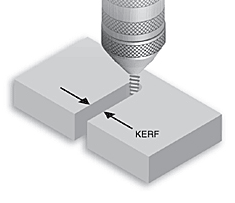

[esabna.com](https://www.esabna.com/us/en/education/blog/what-is-cutting-kerf.cfm)

In this assignment I'll measure the kerf for laser cutting machine.

I have started with Fusion 360 to design a rectangle and divide it by 20 
  
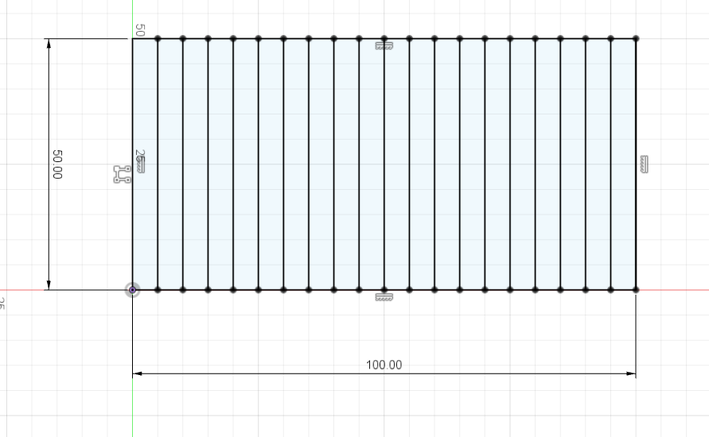

Save the sketch design as DXG by right click in the sketch 

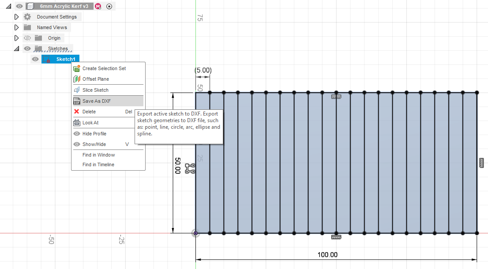

For this assignment I used Trotec speedy 400 flexx laser machine.

Add 6mm Acrylic sheet to the machine and use the keypad to set the focus (AF)

Import the DXF file to the machine software and the set setting as following 

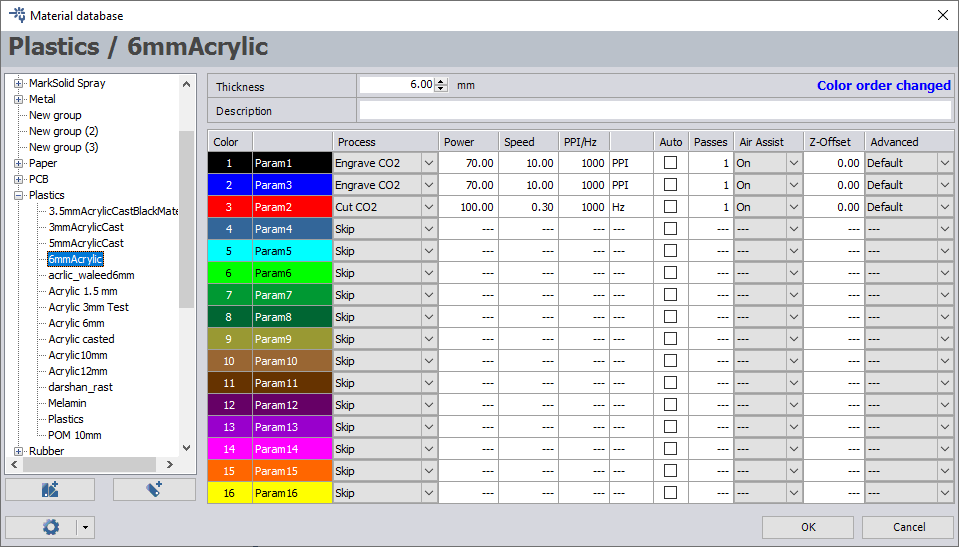

Start cutting the Acrylic sheet 

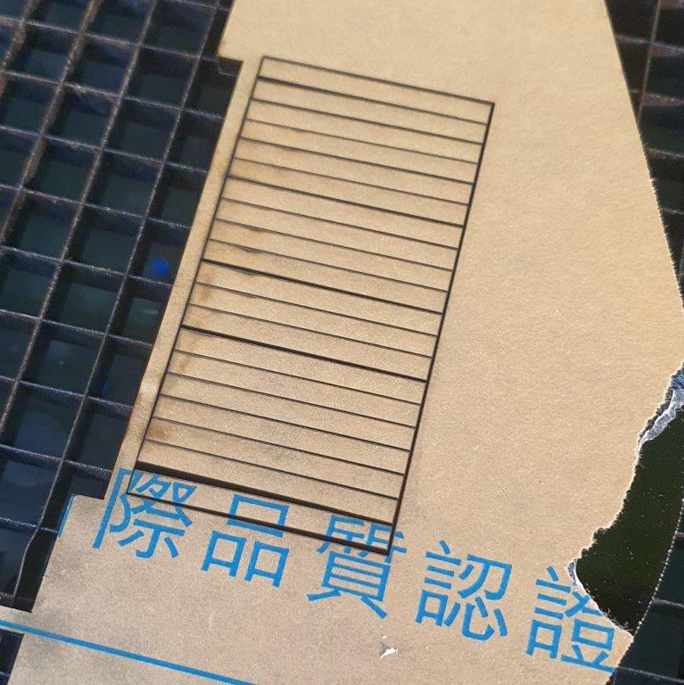

Remove the cutting parts and measure the size 

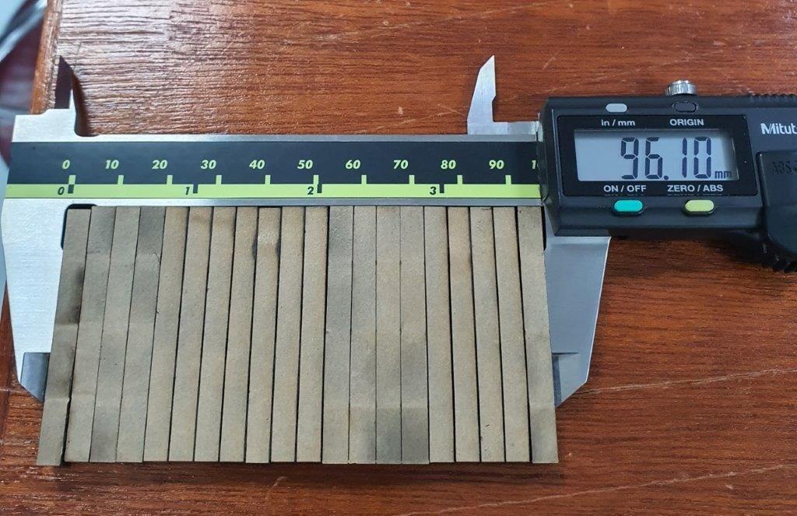

To find the Kerf width use the following equation  

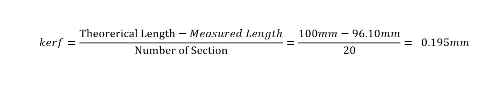