# 5. Electronics production

## **Sara Alhadhrami**

For this week group assignment I tried milling in two ways (Conventional & Climb) by using two different milling bits (0.01 & 1/64).

I used [fab modules](http://fabmodules.org/) website to calculate PCB traces and use it for milling.

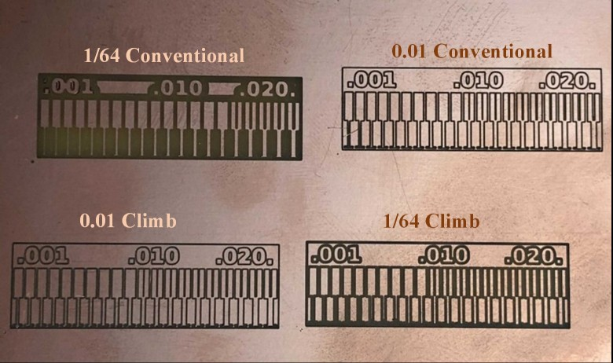

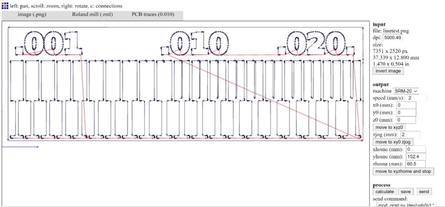

As shown, increasing the size of the milling bit will disappear some of the details.
The result of 0.01 milling bit in both climb and conventional is more clear and we can see the very small details.

## **Fabricate PCB using Fiber laser (Mohammad Alshamsi)**

For this assignment I used Trotec speedy 400 flexx laser machine.

  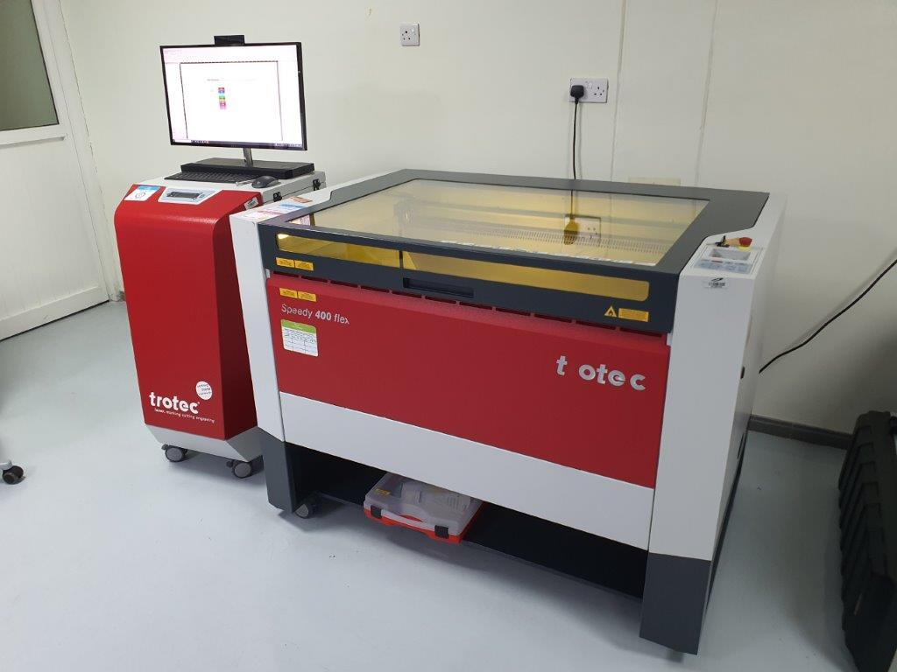

- I used fr1 board for making the PCB

  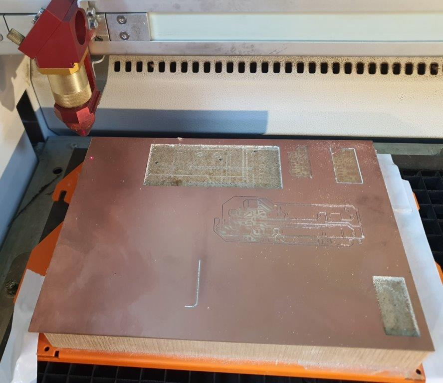

- Fiber laser used to engrave  reflective  material. in our case copper. For that we need to install fiber lens.

  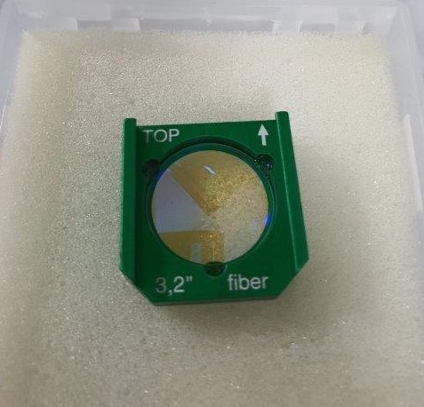

- Make sure to use the green focus tools for fiber engraving.

  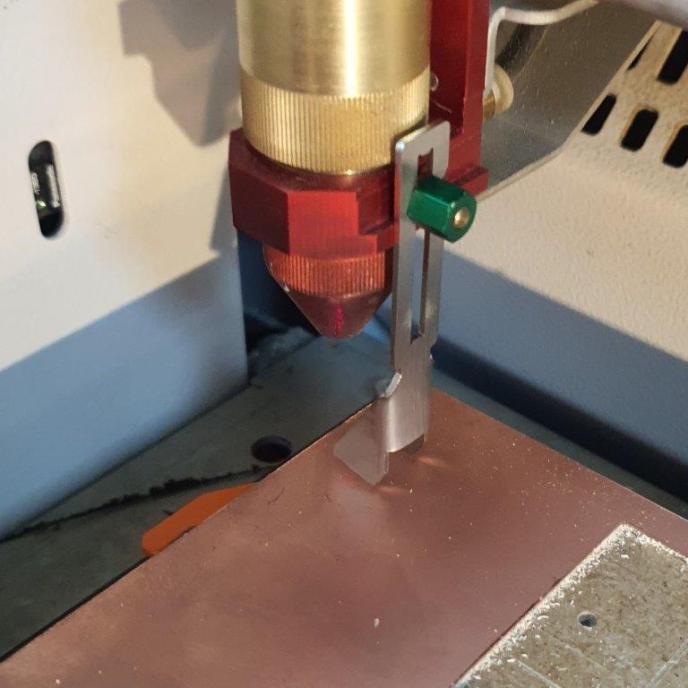

- Use keypad to set the right focus

  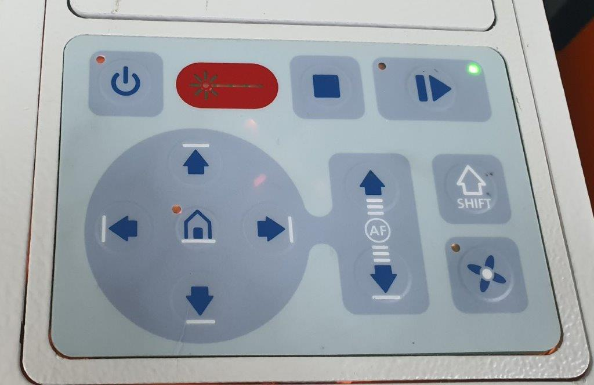

- Now Download line test from [fab academy website](http://academy.cba.mit.edu/classes/electronics_production/Mohammad/linetest.png)

  

- Export the drawing to new

- I start with last year [Group Assignment](http://fab.academany.org/2020/labs/uae/eproduction/epro.html)  best settings as a start point.

- Table below shows the settings for all the tests until I reach the best setting

|#|Process|Power|Speed|PPI/Hz|Passes|
|-|-------|-----|-----|------|------|
|1|EngraveFLP|100|10|30000|10|
|2|EngraveFLP|100|10|40000|10|
|3|EngraveFLP|100|5 |30000|5 |
|4|EngraveFLP|100|20|20000|10|
|5|EngraveFLP|100|20|25000|10|
|6|EngraveFLP|100|15|30000|10|
|7|EngraveFLP|100|15|30000|13|

  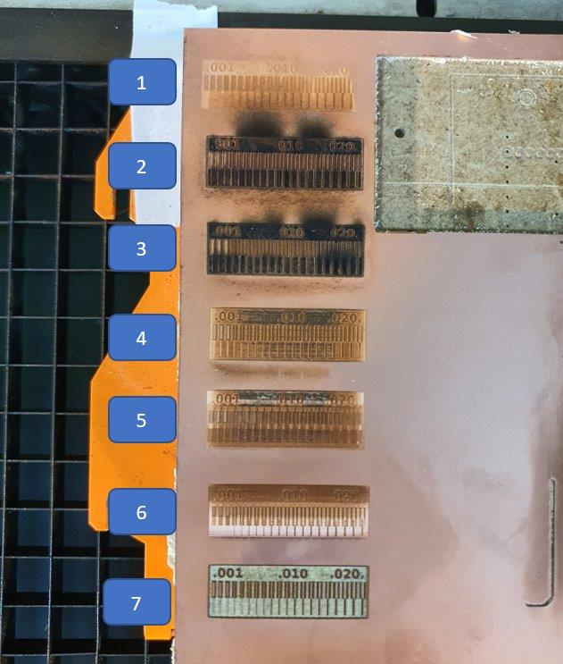

- Use multimeters to check if there is any short circuit

  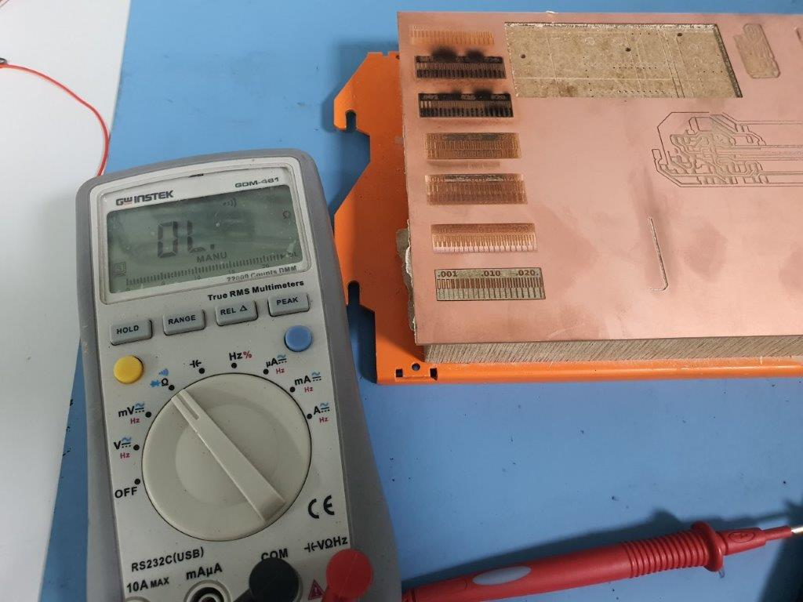

- Test #7 is the best setting for fiber engraving.

  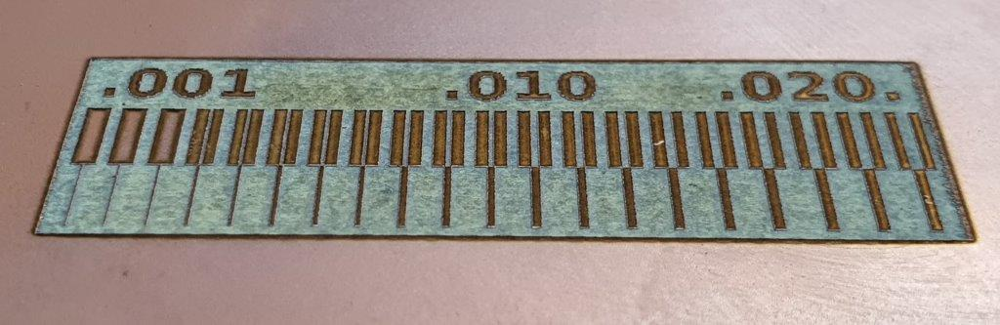

## **Ohood Walid**

My part was to do line test for 0.1 v-bit Climb. I started by generating the toolpath from fabmodules & setting the parameters as shown below:

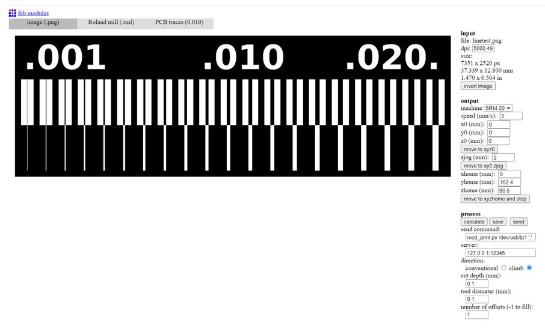{width="60%"}
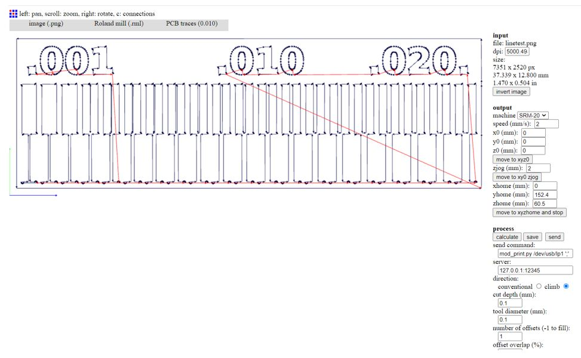{width="60%"}

Then save the RML file & import it to SRM-20 for milling. The result wasn’t good.

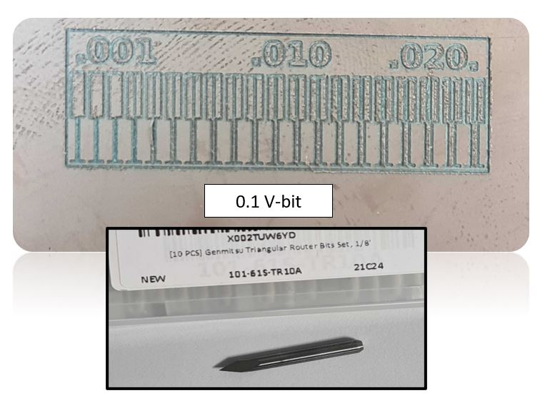{width="60%"}

Also I test the lines with 1/64 bit which was neat

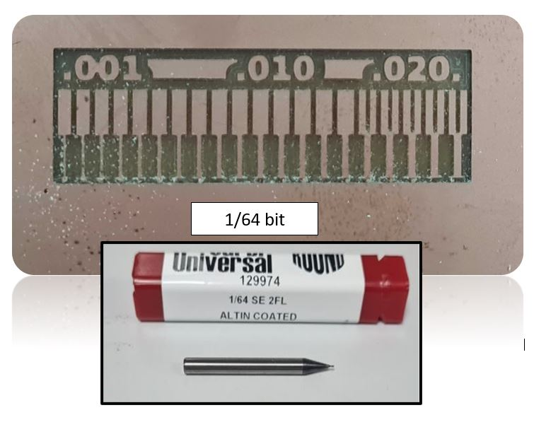{width="60%"}

From this experiment I prefer to use 1/64 for milling the PCB
