# 6. 3D Scanning and printing

## **Overhang Test (Sarah Nadir)**

For the group assignment, I was in charge of testing the overhang. I downloaded the file off of the FabAcademy website and saved it to my flash drive, then I sent it to print.

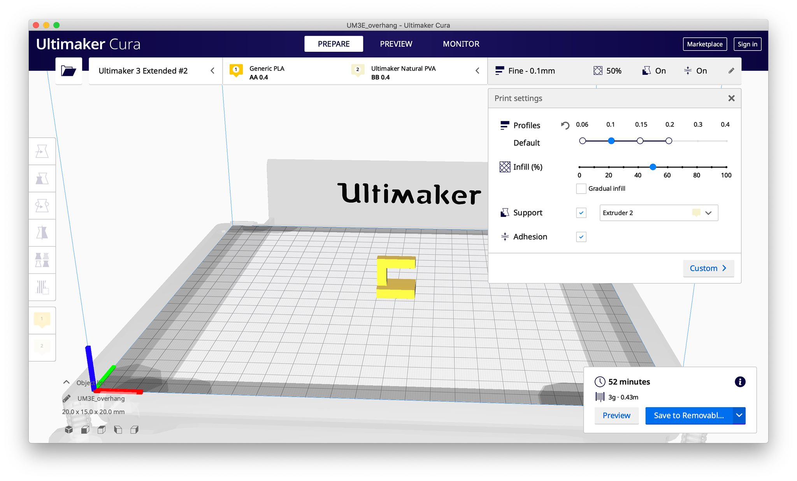

As aforementioned, at first, similar to the previous printing attempts, I had trouble with the print. It would start fine, but then always mess up after the first few layers. I switch my support from `Extruder 2` to `Extruder 1` and funny enough it worked. Although it failed to make sense to me, it made sense to the Ultimaker, and that's all that mattered.

I printed the overhang test with the recommended settings that are defaultly set by Cura, which are as following:

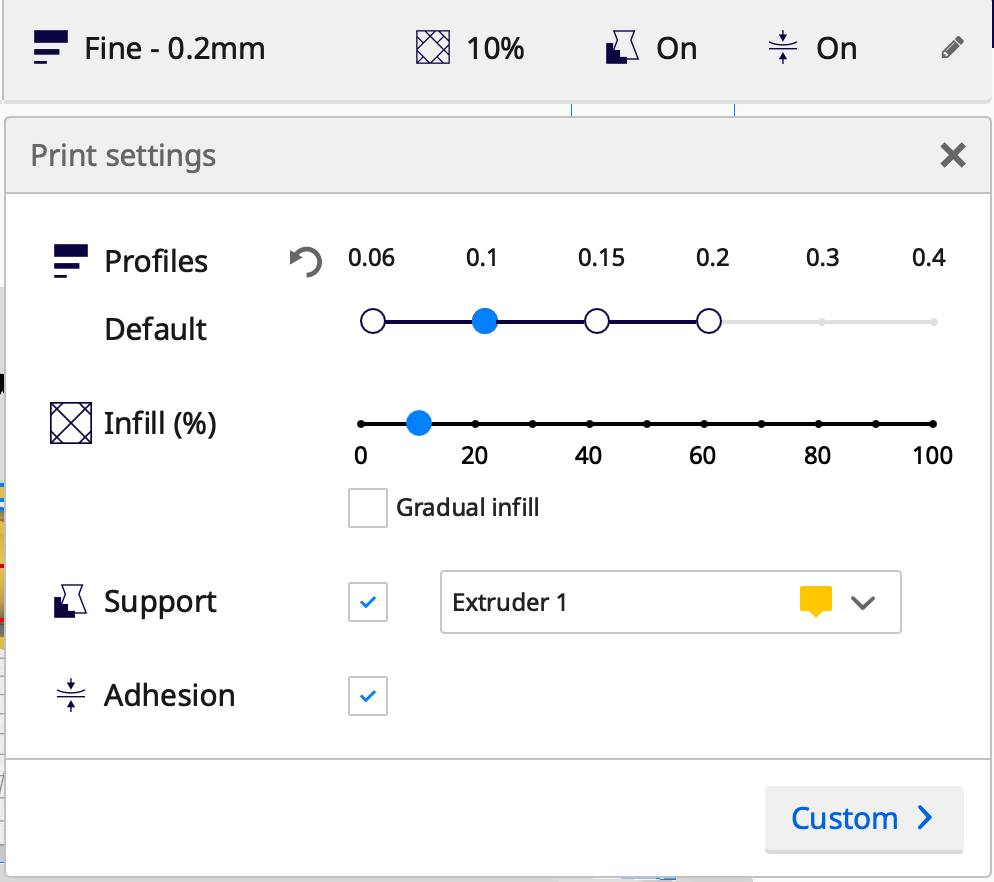

After printing was done, it was clear how crucial the support generated by Cura was for the horizontal piece floating above the base.

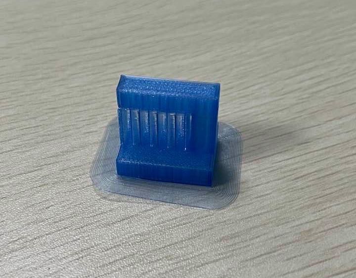

I broke off the support pieces and _voila!_

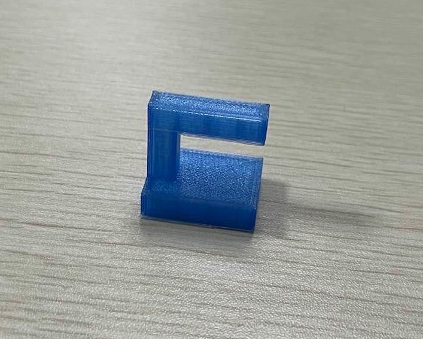

## **Angle Test (Sarah Alhadhrami)**

I downloaded the [STL file](http://academy.cba.mit.edu/classes/scanning_printing/angle.stl) of this design from Fab Academy website.
Then I opened it in Cura and set the print settings as shown in the following image. I didn't click on **Generate Support** because I want to test the 3D printer we have in the lab. I want to see the result of 3D printing different angels from a straight line to a 90 degree angle.

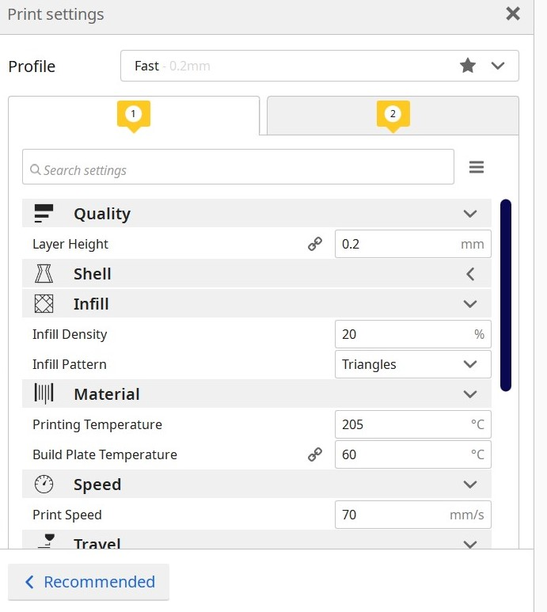{width="80%"}

Then I clicked on **Slice** then **Preview**.

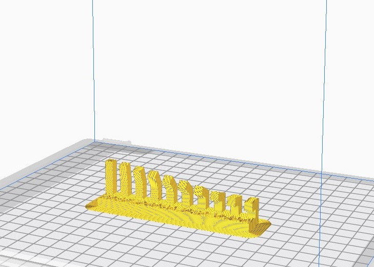{width="80%"}

Finally I saved the file in a flash and insert it in the 3D printer

And here is the result

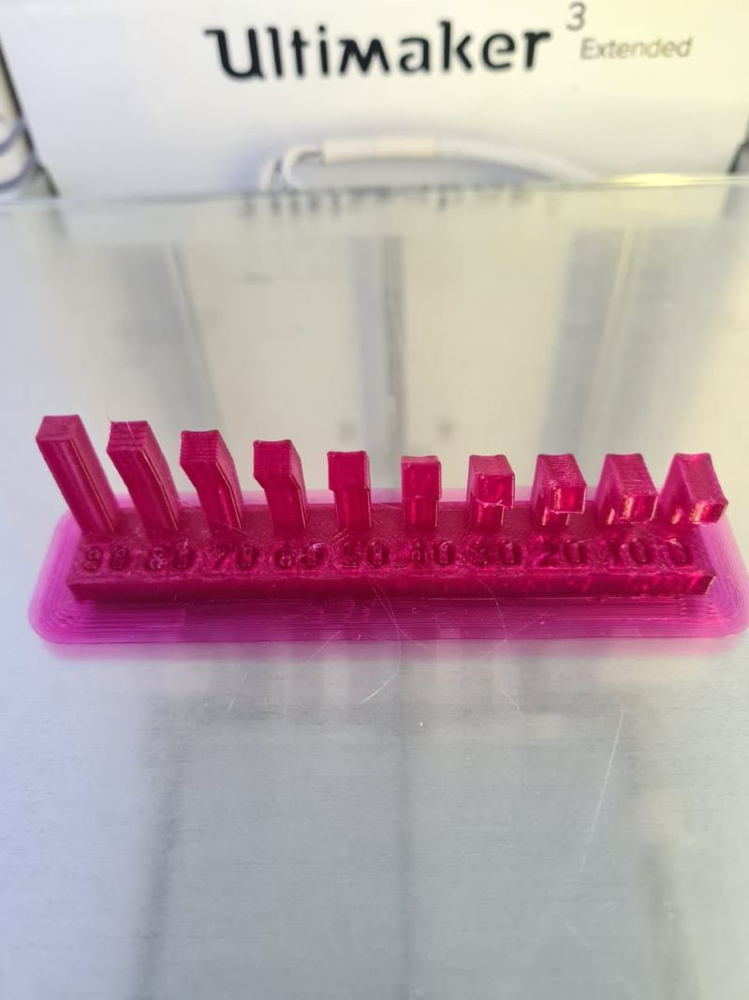{width="80%"}

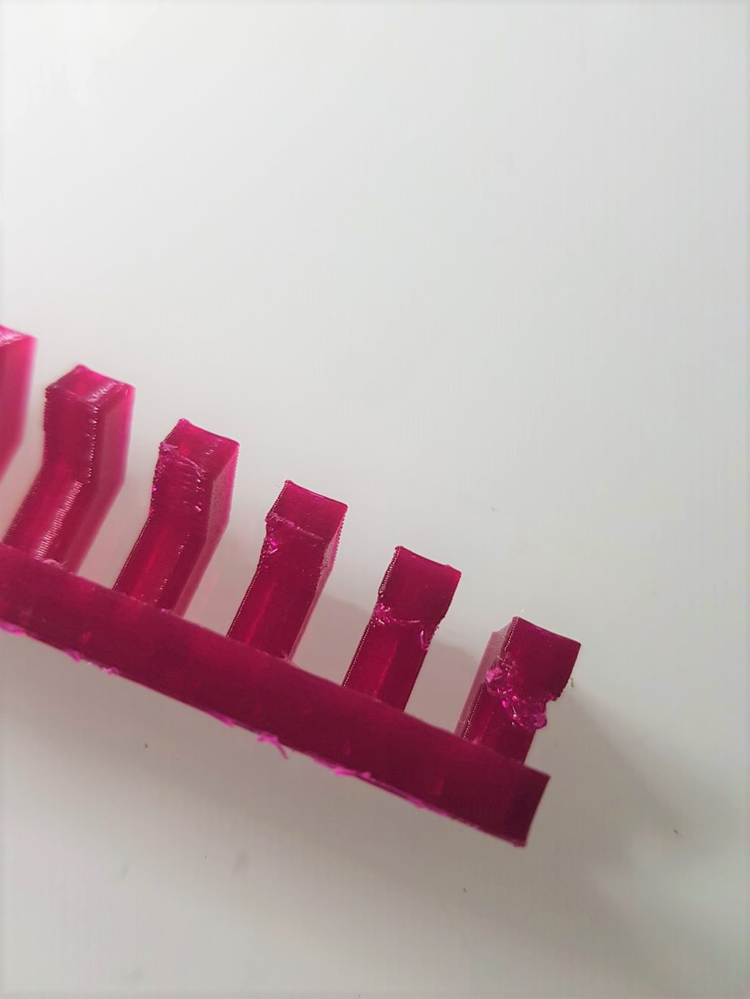{width="80%"}

As shown in the previous images, the material is falling down a little in last two degrees as they approximatly equal to 90.

## **Surface Finish test (Ohood Walid)**

For this week's group assignment, we have to test the design rules and limits of our printer in the lab (Ultimaker 3) my part was to test the surface finish.

first I download the design file from the [Fabacademy website (surface-finish)](http://academy.cba.mit.edu/classes/scanning_printing/index.html)

then set the print setting using ultimaker cura program the main setting that effect the surface finish is layer height so I will try to change this attribute as following:

**Test model pink:** Layer Height= 0.4mm, infill density=10%

Finding > Test model pink: lower resolution & quality but fast printing (8 min)

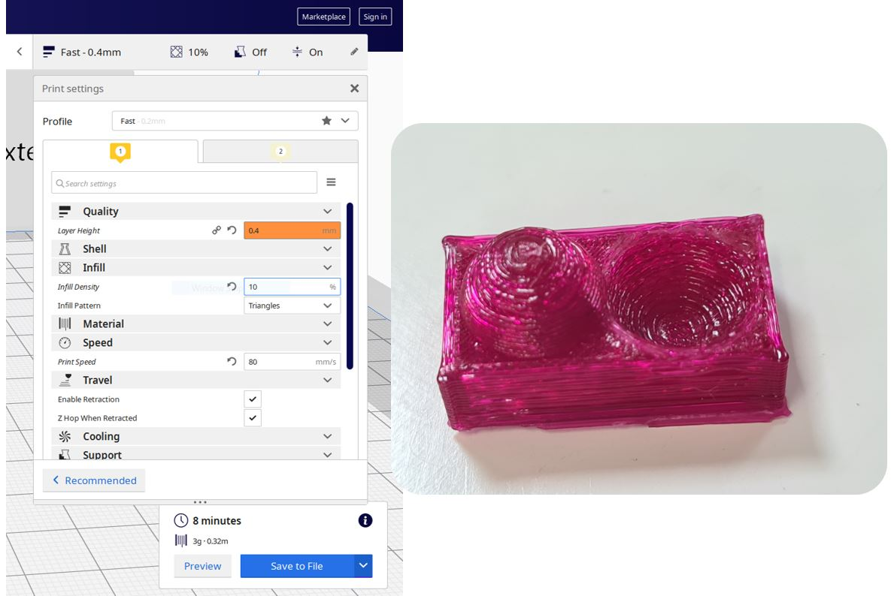{width="80%"}

**Test model blue:** Layer Height= 0.2mm, infill density=20%

Finding > Test model blue: higher resolution & quality but slower printing (36 min)

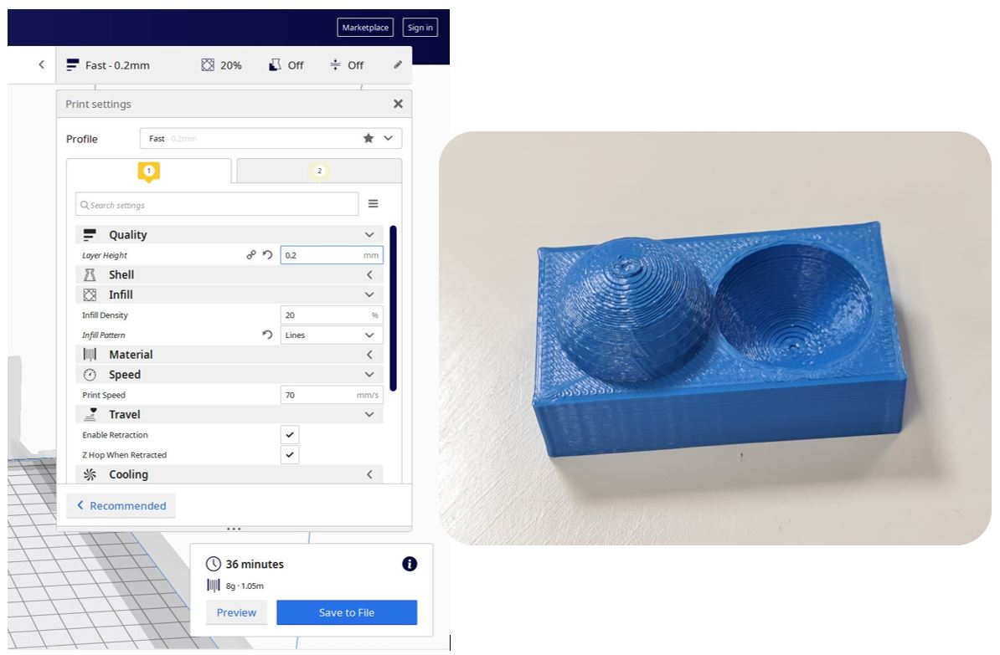{width="80%"}

to sum it up, it is advisable to use Layer Height= 0.2mm for better quality surface finish & I will be using this for my future 3D printing even if it takes longer but worth it.

## **overall test (Ohood Walid)**

I downloaded the design STL file from [thingiverse website](https://www.thingiverse.com).Then I opened it in Cura and set the print settings Layer Height= 0.2mm, infill density=20%, printing speed 70mm/s, travel speed 120 mm/s.

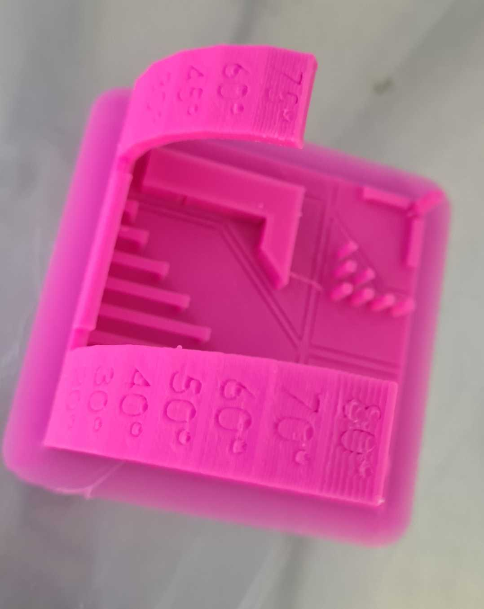{width="60%"}

the printing was neat for most of the details.

## **Printing tolerance test (Abdallah Alsafadi)**

PART 1:

I wanted to test the accuracy of the 3d printer.

so I designed a jar with lid.

and I printed it to see if the dimensions are right and the lid will fit the jar.

the jar outer D was 80 and the inner was 73.

the lid outer was 80 and the inner was 72.98

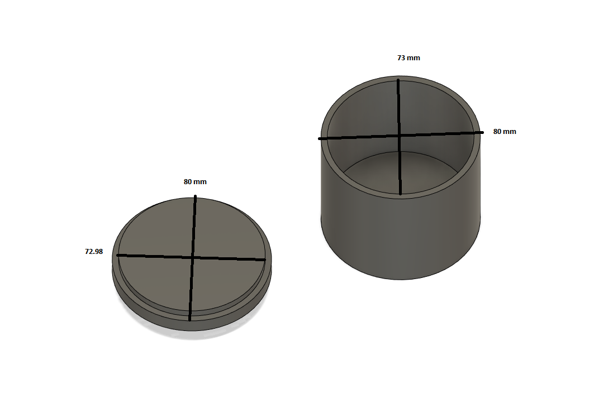

then on CURA I put layer height 0.1 mm and infill to 20% and I printed both the lid and jar.

the result was like this.

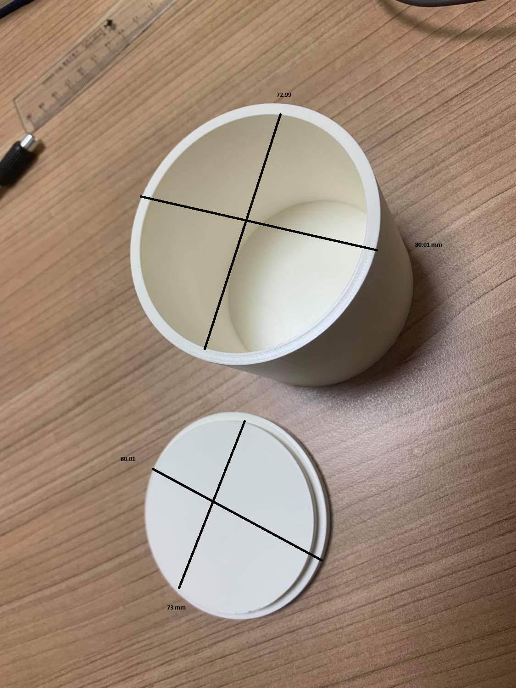

this means is increasing the thickness of any printed piece between 0.01 mm and 0.02 mm.

PART 2:

I printed this test 3d design from thingiverse [all in one](https://www.thingiverse.com/thing:2806295)

I used the following setting while printing.

Material: PLA.
Printing Temp: 195.
Build plate temp: 65.
infill: 100%.
support: no.
rafts: no.
wall thickness: 1mm.
retraction: 6.5.
briming: on.

result print:

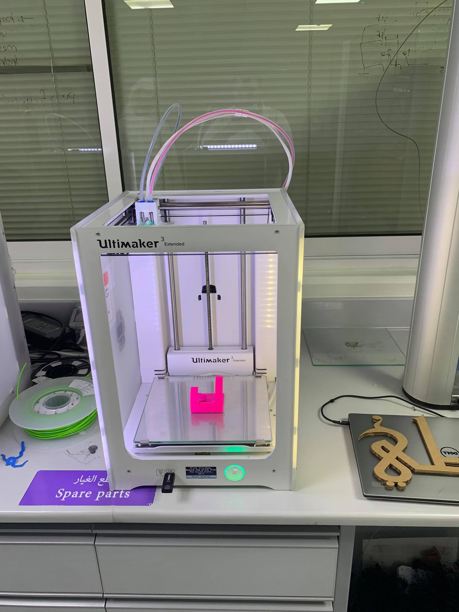

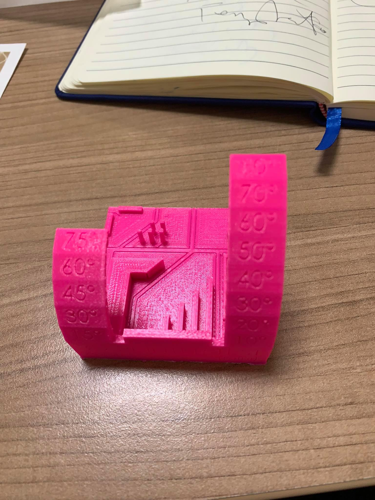

Findings:

1- 195 is a suitable temp to avoid over or under extrusion.

2- I can print upto 25 mm bridge without a problem.

3- I can print with an angle increment of 10 and 15 degrees without causing a failure.

4- setting the right retraction (6.5) amount and briming reduce the stringing.

## **XYZ 20mm Calibration Cube test (Mohammad Alshamsi)**
Temperature is the key a factor for 3D printing. For the Group assignment I'll test printing with different temperatures to find the best temperature for 3D printing.

- I have downloaded the XYZ 20mm Calibration Cube from [thingiverse.com](https://www.thingiverse.com/thing:1278865)

- For printing XYZ 20mm Calibration Cube I'll use my [Formbot T-Rex 2](https://www.formbot3d.com/products/formbot-large-format-industrial-3d-printer-with-400x400x470mm-build-size-13) 3D Printer with 400x400x470mm Build Size

  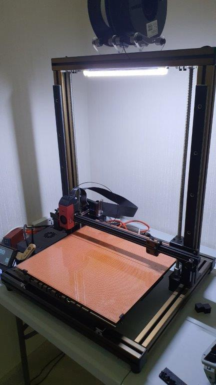

- For better bed adhesion I used blue tape

  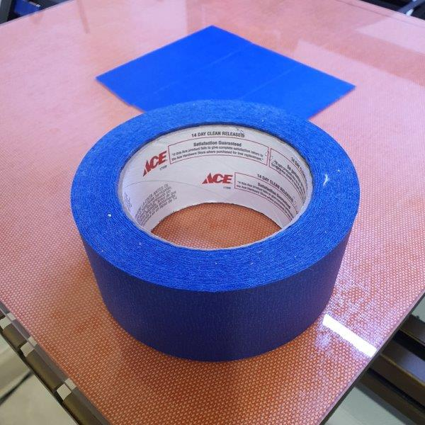

- For 3D printing slicing software I used [Simplify3D](https://www.simplify3d.com/) which has more control feature for this 3D printer.

  

- For the filament I used PLA+ which is more stronger than normal PLA filament.

  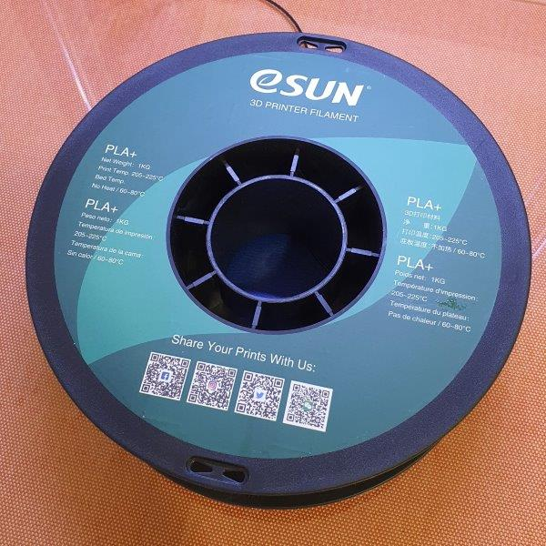

- I have uploaded the STL file to the Simplify3D software I print it with different temperature settings.

- Test #1: temperature 220 °C

  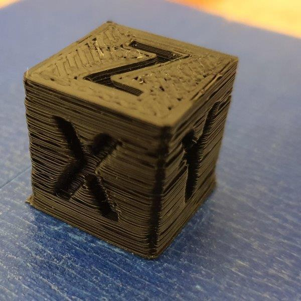

- Test #2: temperature 210 °C

  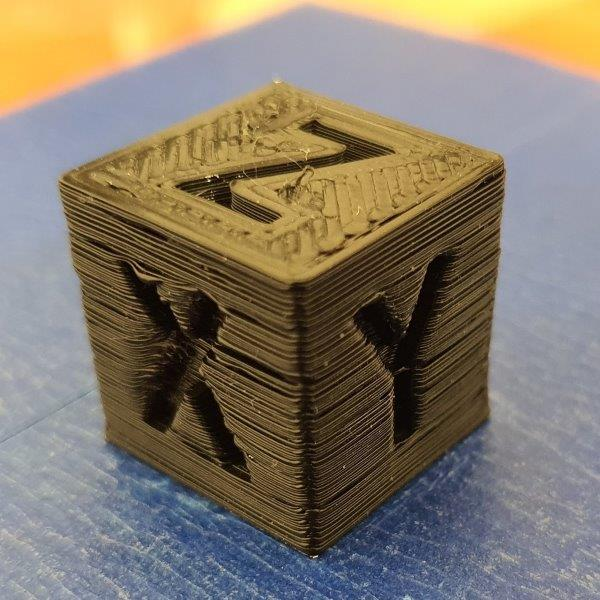

- Test #3: temperature 200 °C

  

- Test #4: temperature 190 °C

  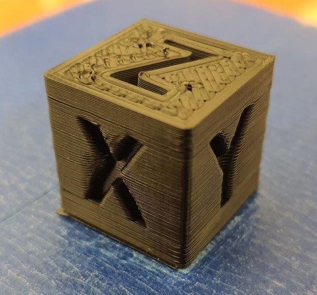

The below table shows the comparison between the tests:

| #   | Temp. | Print Quality | X       | Y       | Z       |
| --- | ----- | ------------- | ------- | ------- | ------- |
| 1   | 220°C | Bad           | 20.3mm  | 20.2mm  | 20.05mm |
| 2   | 210°C | Bad           | 20.35mm | 20.25mm | 20.15mm |
| 3   | 200°C | Good          | 20.05mm | 20.0mm  | 20.0mm  |
| 4   | 190°C | Best          | 20.3mm  | 20.3mm  | 20.15mm |

Overall for the most accurate  print 200°C is the best temperature, but if you want the best print quality then go with 190°C.  
