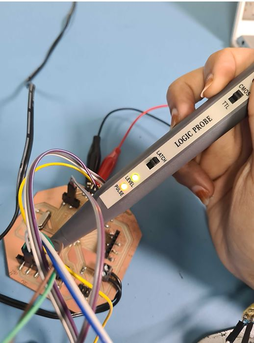
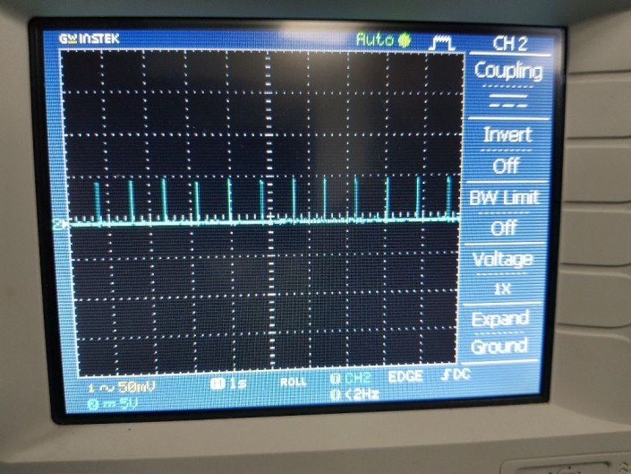
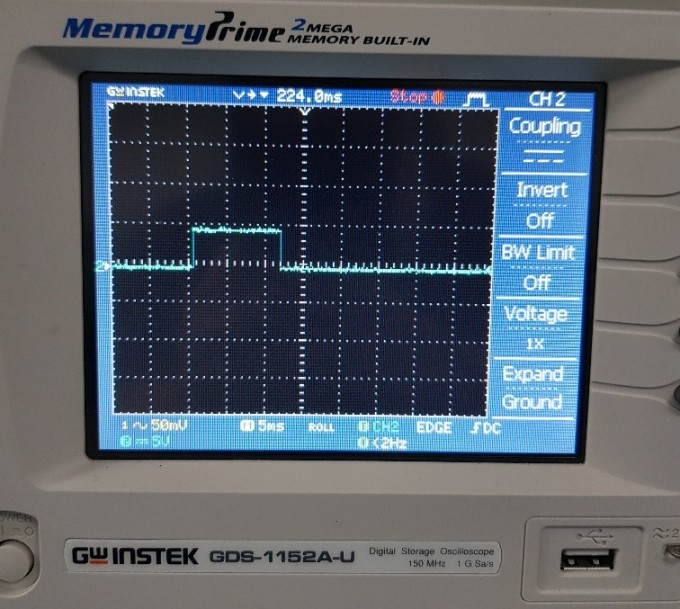

# 7. Electronics design

## Requirements:
1.  Redraw the attiny45 board with the following conditions:
- use different Microcontroller (for ex: attiny44 or atmega328)
- it should include at least one LED with current limiting resistor and one button
- extra credit: add different inputs and outputs

## Deadline: Sunday 10/1/2021

## Support Material

- Introduction to PCB Design with Eagle CAD (Recorded lecture by Fablab UAE)
<iframe width="560" height="315" src="https://www.youtube.com/embed/u_EjbBBpyro" frameborder="0" allow="accelerometer; autoplay; clipboard-write; encrypted-media; gyroscope; picture-in-picture" allowfullscreen></iframe>
- [Fablab Eagle Library](https://gitlab.fabcloud.org/pub/libraries/electronics)

- [attiny45 ttraffic light schematic](../files/w7/attiny45light.sch)
- [attiny45 ttraffic light Board](../files/w7/attiny45light.brd)

## **Logic Probe & multimeters (Ohood Walid)**

In this week group assignment, I’m measuring & testing the input digital circuits using Logic Probe measurements tool.

The logic probe one of the low-cost tools that easy to use help in testing the digital circuits with very basic information.

So if the green light appear it mean that that the logic high which state that it is able to detect digital pulses as shown when I tested the digital flow in my board.

{width="50%"}

also I used multimeters to check the connectivity of my PCB

<iframe width="560" height="315" src="https://www.youtube.com/embed/_Lhf6K9PQgA" frameborder="0" allow="accelerometer; autoplay; clipboard-write; encrypted-media; gyroscope; picture-in-picture" allowfullscreen></iframe>

## **Sara Alhadhrami**

For the group assignment, first I checked the continuity between components by using the Digital Multimeter. The beep sound means pins are connected and when there is no sound means the two pins are not connected.

<iframe width="660" height="415" src="https://www.youtube.com/embed/_BtxREbSH3s" title="YouTube video player" frameborder="0" allow="accelerometer; autoplay; clipboard-write; encrypted-media; gyroscope; picture-in-picture" allowfullscreen></iframe>

Then I measured the supplied voltage by connecting my board with the laptop. I used the Digital Multimeter and I touched the VCC pin with the positive probe and the negative probe on the GND.

<iframe width="660" height="415" src="https://www.youtube.com/embed/mNC-KGB2D7w" title="YouTube video player" frameborder="0" allow="accelerometer; autoplay; clipboard-write; encrypted-media; gyroscope; picture-in-picture" allowfullscreen></iframe>

I also used the digital probe to check the pins that are connected to VCC and pins connected to GND. If the Level LED lights up means this pin is connected to VCC and vice versa if connected to GND. First two pins in the video connected to GND and last pin connected to VCC.

<iframe width="660" height="415" src="https://www.youtube.com/embed/X4AtZjlQZf4" title="YouTube video player" frameborder="0" allow="accelerometer; autoplay; clipboard-write; encrypted-media; gyroscope; picture-in-picture" allowfullscreen></iframe>

I Also used the **oscilloscope** to see the signals of Eco pin in an **Ultrasonic Distance Sensor**.
The following video shows the 5V supplied to the board and the output signals from ECO pin. Signals of Trig pin (Input) are represented as impulses.

<iframe width="660" height="415" src="https://www.youtube.com/embed/qIDbePMHwm4" title="YouTube video player" frameborder="0" allow="accelerometer; autoplay; clipboard-write; encrypted-media; gyroscope; picture-in-picture" allowfullscreen></iframe>           

Echo pulses at 1 second time interval width.

{width="80%"}

Echo pulses at 5ms time interval width.

{width="80%"}

** Abdallah Alsafadi**

I measured the voltage for Attiny44 input and it was 5V.

<iframe width="560" height="315" src="https://www.youtube.com/embed/x5294BOJDRw" title="YouTube video player" frameborder="0" allow="accelerometer; autoplay; clipboard-write; encrypted-media; gyroscope; picture-in-picture" allowfullscreen></iframe>
