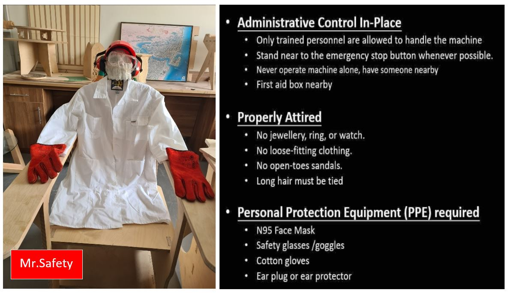
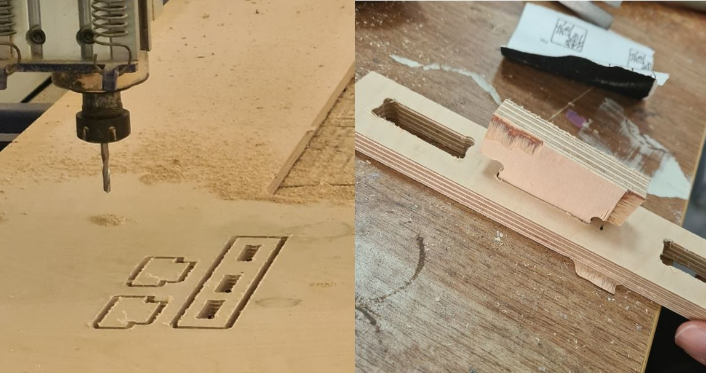
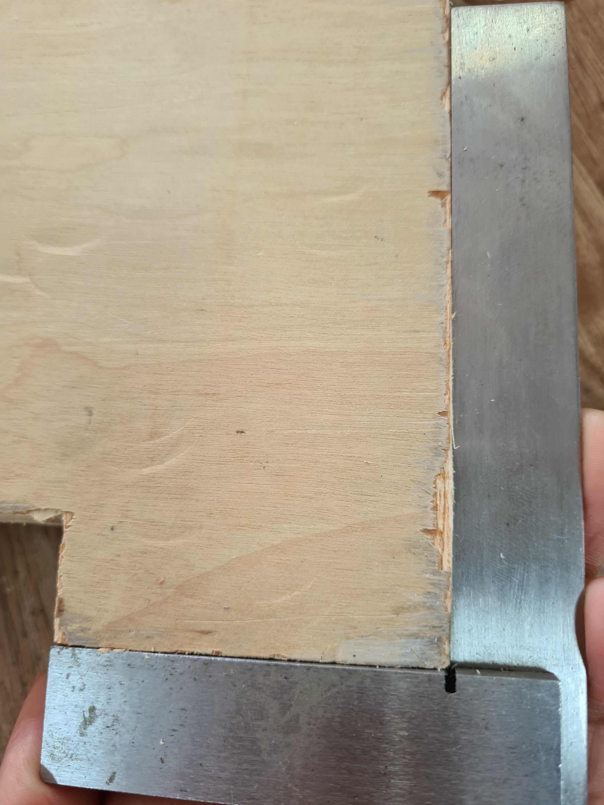
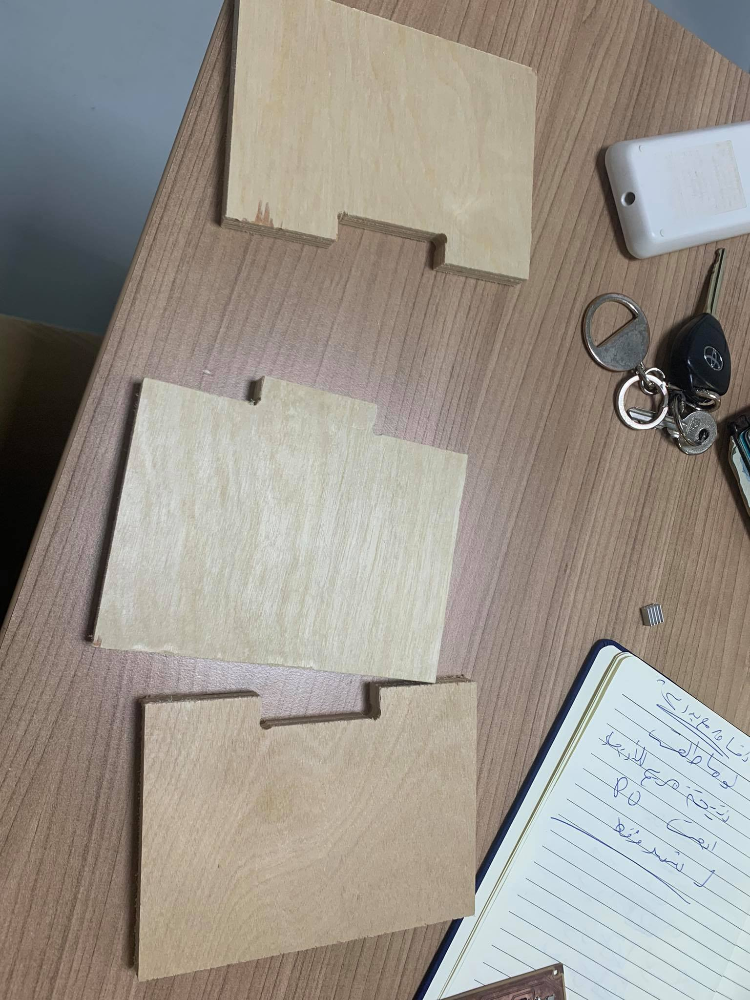
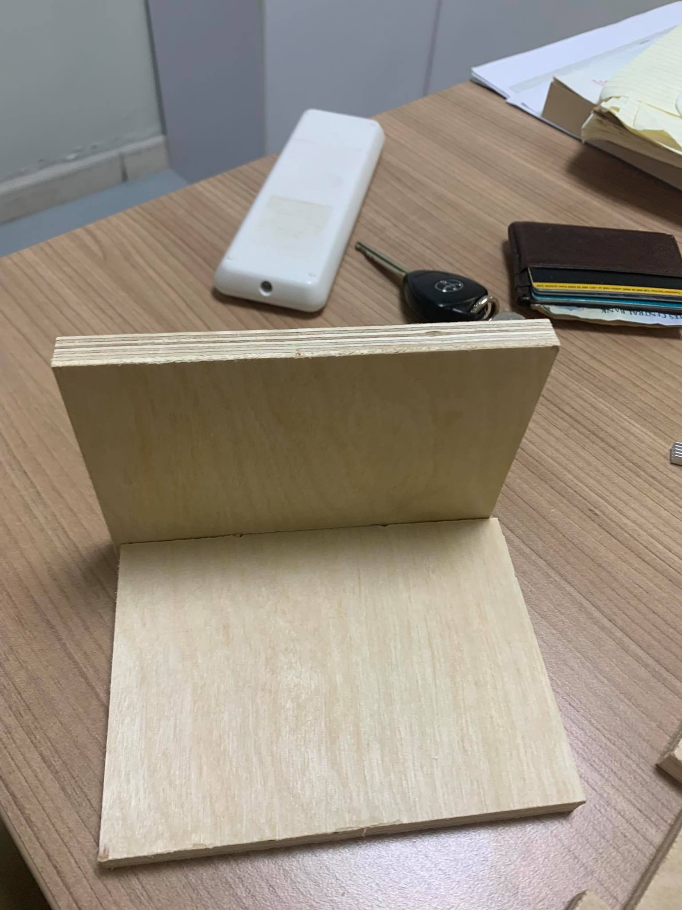
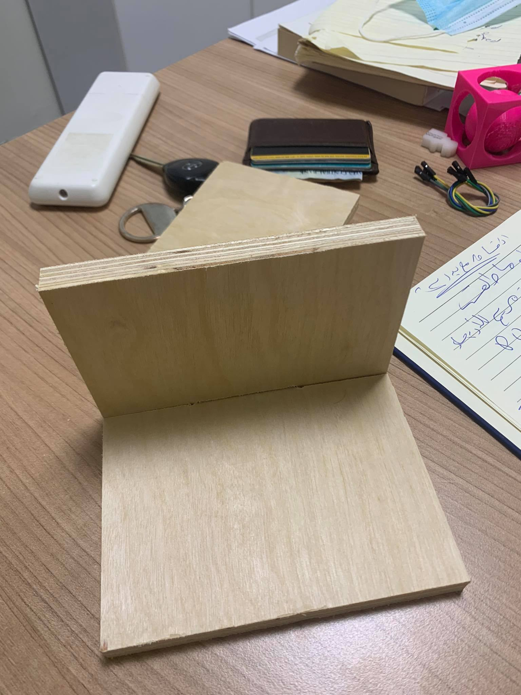

# 8. Computer controlled machining

The group spent some time to familiarize ourselves with the lab's safety measure and testing the machine.

SAFETY FIRST

Gear up by following Safe Work Practices in our lab

{width="80%"}

Test the CNC machine ShopBot

we drew some rectangular test slots of similar size with difference of adding 0.1mm & 0.2mm & 0.4mm as shown in the picture below to test the joints and the best clearance value that will fit perfectly.

Feeding the measurement & setting:

-select the profile toolpath in toolpath operation then insert the material thickness 12mm plywood

-The cut depth 13.5mm with the step down of 3mm

-the tool end mill 6mm with spindle speeds 12000 & feed rate 2500

-machine vectors are outside we didn’t add a Tabs since it is a small pieces however it is advisable to add Tabs if the design is big

{width="50%"}

The best clearance value was adding 0.2mm that will insure proper fitting.

**ALIGNMENT TEST:**

using try square tool to check the angles is accurate 90° angles of the piece. As shown in the picture below that the angles is 90°.

{width="80%"}

** abdallah alsafadi **

I wanted to test the fitting for the shopbot.

So Designed three pieces. and I cut them with Shopbot and I used 12 mm plywood.

 the setting I used:

- end mill (6mm)
- pass depth:3mm.
- stepover: 3mm.
- spindle speed: 10000 rpm.
- feed rate: 3.
- start depth:0.
- cut depth: 12.3.
- outside cutting.

1 male piece with 50 mm pocket.

1 female piece with 50 mm head.

1 female piece with 49.8 mm head.

the 50 mm was fitting nicely but a bit lose.

the 49.8 mm was hard to fit but is firm and tight fit.

