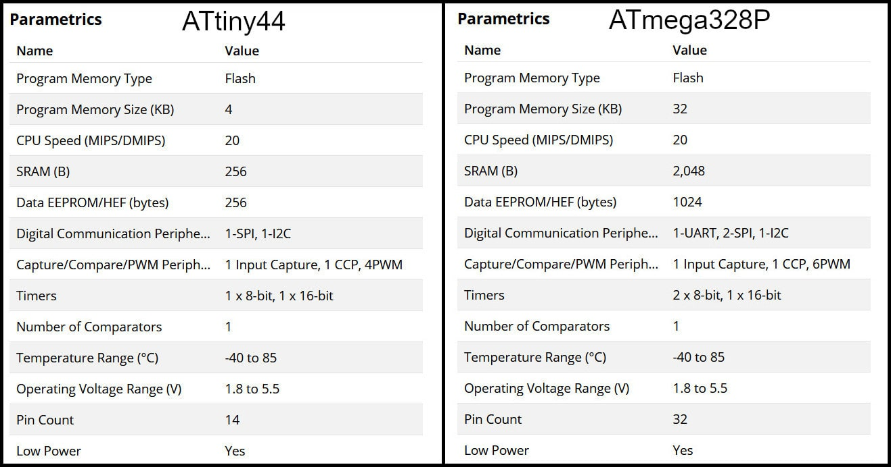

# 9. Embedded programming

## Group assignment:
    Compare the performance and development workflows for other architectures

## Arduino IDE
 [**Mohammad Alshamsi**](http://fabacademy.org/2021/labs/uae/students/mohammad-alshamsi/) works in Arduino IDE to program the ATmega328P

 

 The Arduino Software (IDE) runs on Windows, Macintosh OSX, and Linux operating systems. It is easy-to-use for beginners and flexible enough for advanced users .The language can be expanded through C++ libraries and  you can add AVR-C code directly into your Arduino programs.

## **Ohood Walid**

In this Group assignment we will compare the programs of various programming languages and programming environments as possible.

## XOD

{width="80%"}

I used [XOD](https://xod.io/) which is a visual programming environment that enables you to program an Arduino without writing any code by only manipulate objects called “nodes” in a wide working area that's called a “patch” that can includes one or more patches. Once your program is finished you deploy it to the Arduino as if you are using the Arduino IDE. Therefore, XOD is ideal for ppl who don’t know how to write a code to be able to rapidly develop Arduino projects if you have an idea in mind and don’t want to be stuck writing the software.

**What I like:**

•visual programming environment

•free open-source

•the connection shown in clear path flow

•easy to learn & use

**what missing:**

•not supporting attiny microcontroller

## **ArduBlock (Sara Alhadhrami)**

 [ArduBlock](http://blog.ardublock.com/engetting-started-ardublockzhardublock/) is a graphical programming language for Arduino. This language uses graphical blocks to make complete codes to program any PCB. The graphical code is translated into a program in Arduino language.

For example, I did a blink code by using the graphical blocks in Ardublock then when I upload it into my ATtin44 board, it was translated automatically into a full code in Arduino language as shown in the following images.

## **abdallah alsafadi**

### Aduino IDE

​ Arduino IDE Arduino is a very popular and most commonly used open-source electronics platform based on easy-to-use  software and Hardware. Arduino is fundamentally a C/C++ programing environment. It operates a coding language called Wiring which is simple, which makes it easy to write coding scripts to send to the microcontroller to perform  tasks. These scripts are called Sketches by Arduino. Usually shields come with already written sketches  that can be loaded in to the app, compiled and downloaded to the base board. 

​

Advantages: ​

Cross-platform - runs on Windows, Macintosh OSX, and Linux operating systems. Most microcontroller systems are limited to Windows. ​

Easy to learn with a lot of online resources to learn ​

Huge supporting community. ​

Simple and easy programming environment - thaT IS easy-to-use for beginners and all other levels , yet its flexible enough for advanced users to test their maximum abilities. ​

Open source and extensible software - The Arduino software is published as an open source tool, available to be extensioned by experienced programmers. The language can be expanded through C++ libraries, and people wanting to understand the technical details can make the leap from Arduino to the AVR C programming language on which it’s based. Similarly, you can add AVR-C code directly into your Arduino programs if you want to. ​

Disadvantages: ​

No understanding of the AVR microcontroller. ​

shields and Sketches  can be considered difficult to modify. ​

No debugger included for checking scripts. When errors arise, some do not have a clear statement of where or why this error message is showing, it won’t direct you or give solution unless you have experience with Arduino. ​

For using with Attiny. Attiny 44 in our case, we need to install the package, it is also required to burn the Arduino bootloader onto the chip to make sure the chip will accept any programs uploaded via the Arduino IDE.

## Attiny44 VS Atmega328:

in the table below you can find the comparision between both micro controllers. “tinyAVR microcontrollers (MCUs) are optimized for applications that require performance, power efficiency and ease of use in a small package”, where “megaAVR microcontrollers (MCUs) are the ideal choice for designs that need some extra muscle. For applications requiring large amounts of code.”

So I tried to upload a long code on both controllers to see how they perform.
First I upload a code on the Atmega328p and the result on compiling is shown below.

the total size of the long code was 32134 bytes and it took 99% of the total size of the atmega. it took a bit long but it compiled successfully.

the result of uploading a shorter code is shown in the image below.

The size of the code was 4546 bytes and it was 110% of the Attiny size so the compiling failed.
