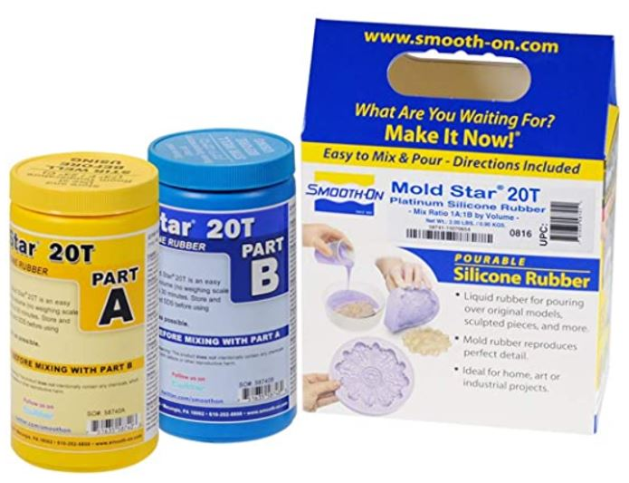
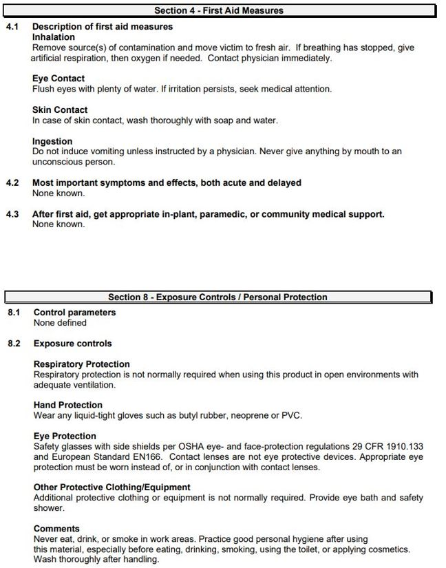
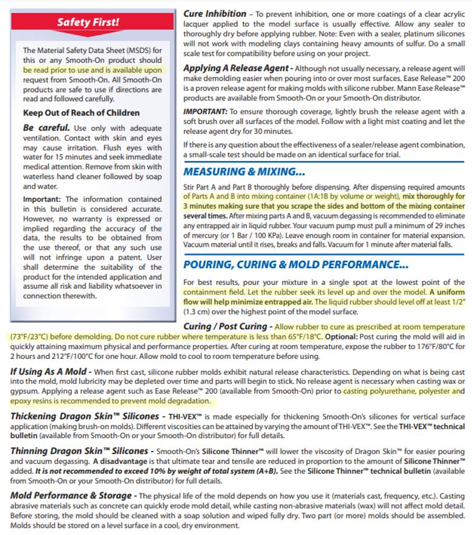
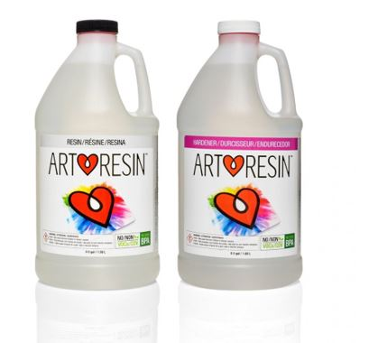
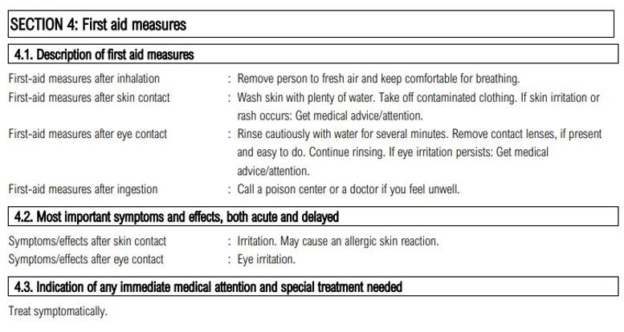
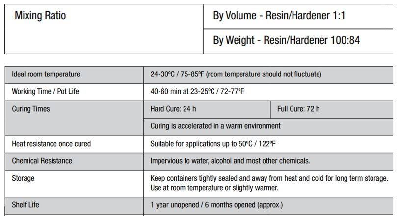
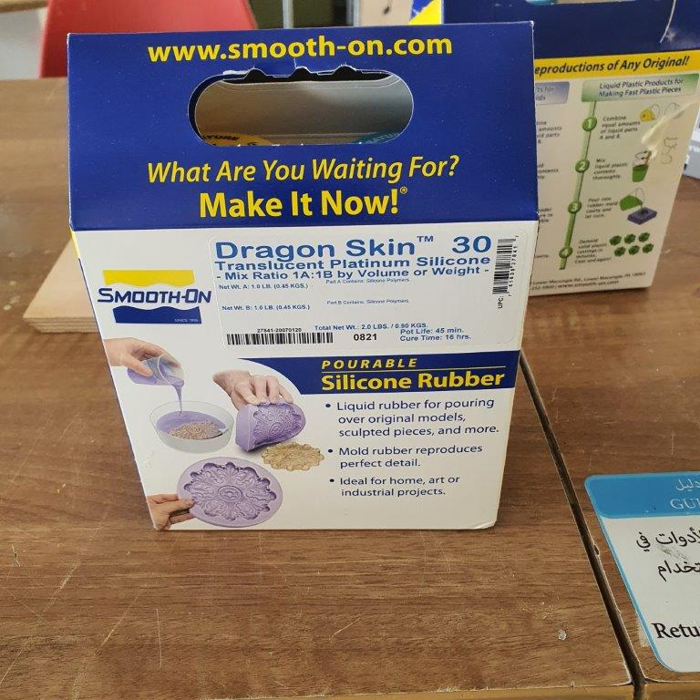
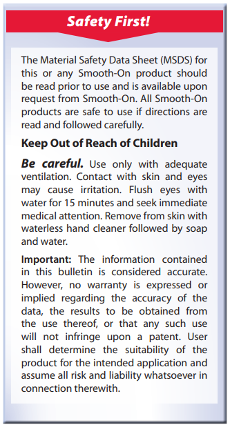
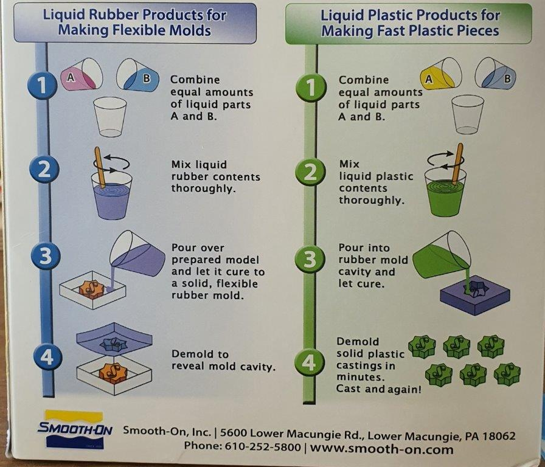
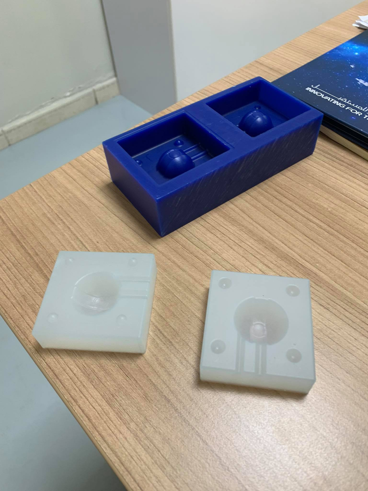

# 10. Molding and casting

## **Ohood Walid**

We spent some time to familiarize ourselves with the lab's safety measure and review the safety data sheets for each of your molding and casting materials.

Molding: SMOOTH ON SILICONE DRAGON SKIN ®

{width="80%"}

We read [the Safety Data Sheet](https://www.smooth-on.com/msds/files/BD_DS_Eco_Equ_EZB_EZS_Psy_MS_OOMOO_Reb_ST_SS_Soma_Sol_Sorta.pdf) before using the material, especially the first aid measures as shown below to know what to do if you get exposure to the material and the best measure to follow to protect yourself.

{width="80%"}

the technical data sheet summarize in the follow [TD PDF](https://www.smooth-on.com/tb/files/DRAGON_SKIN_SERIES_TB.pdf) that give the user a clear steps to use the material, I highlighted the important points in yellow.

{width="80%"}

Casting: ART RESIN®

{width="80%"}

Before doing the casting by using ARTRESIN® we have to read [the Safety Data Sheet](https://media.easycomposites.co.uk/datasheets/ArtResin-Safety-Data-Sheet-ENG-V1-1.pdf) to familiarize ourselves with the first aid measures after exposure to the material.

{width="80%"}

Also we have to go through [the Technical Data Sheet](https://cdn.shopify.com/s/files/1/0770/0749/files/ArtResin-Technical-Data-ENG-FR-ES-DEU-ITL-DUT-2020.pdf?v=1606492956) to know the mixing ratio 1:1 & other important information about the material to have smooth casting.

{width="80%"}

## **Mohammad Alshamsi**
For the Casting I'll use [Dragon Skin 30](https://www.smooth-on.com/products/dragon-skin-30/)

  

**Warning:** You must read the [safety Datasheet](http://www.smooth-on.com/msds/files/BD_DS_Eco_Equ_EZB_EZS_Psy_MS_OOMOO_Reb_ST_SS_Soma_Sol_Sorta.pdf) before using this material

**Safety First:** Use in a properly ventilated area (“room size” ventilation). Wear safety glasses, long sleeves and rubber gloves to minimize contamination risk. Wear vinyl gloves only. Latex gloves will inhibit the cure of the rubber. [www.smooth-on.com](https://www.smooth-on.com/products/dragon-skin-30/)

Follow the instruction in the back of the box

For more Technical Data chick the [Technical DataSheet](http://www.smooth-on.com/tb/files/DRAGON_SKIN_SERIES_TB.pdf)

The most important data are shown in table below.
|||
|------|-----|
|Pot Life	|45 minutes|
|Cure Time	|16 hours|
|Mix Ratio By Volume|	1A:1B|
|Mix Ratio By Weight|	1A:1B|
|Color	|Translucent|

## **abdallah alsafadi**

### Safety:

Since all of us were sharing the same working table (large decent one for safety!), while working on different materials, we took the same safety precautions even if some of the martials were labeled as safer than some others, to reduce the risk of serious contamination.

We read the safety precautions in the datasheet and followed it to ensure everyone is safe while working and handling the material. We wore 2 vinyl gloves on top of each other, and tied any loose clothing with scotch tape, wore plastic aprons, a set of goggles, and an industrial mask on top of our existing masks.

### Molding:

The following table is a comparison between the kinds of materials that we used to create the molds in this week's assignment:

| Student |  Design    |  Mold Type  | Ratio  | measurements  |Curing Time   |
|---------|-----------------|---------|--------|--------|---------|
|Abdallah Alsafadi | PokeBall | Dragon Skin 30 | 1:1 | 133 g |16 H |

### Casting:

| Student | Material    | Ratio  | measurements  |Curing Time   |
|---------|-----------------|--------|--------|---------|
|Abdallah Alsafadi | Epoxy resin ( Art Resin) |  1:1 | 30 g |16 H |
