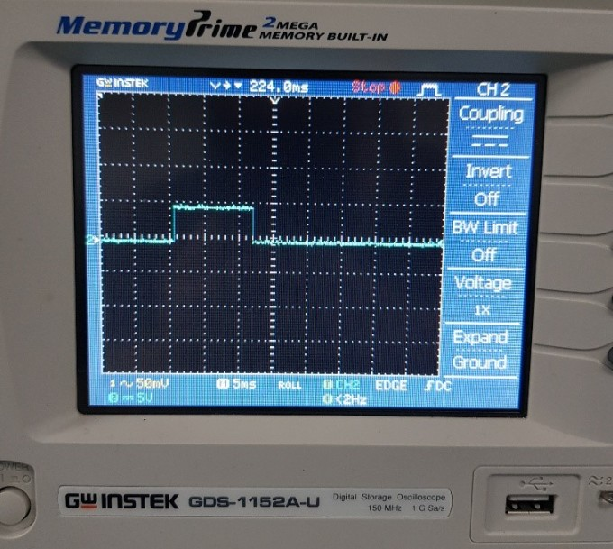

# 11. Input devices

## **Ohood Walid**

In this week group assignment, I’m measuring & testing the input digital circuits using Logic Probe measurements tool.

The logic probe one of the low-cost tools that easy to use help in testing the digital circuits with very basic information.

So if the green light appear it mean that that the logic high which state that it is able to detect digital pulses as shown when I tested the digital flow in my board.

{width="80%"}


## **Ultrasonic Distance Sensor (Sara Alhadhrami)**

I used the oscilloscope to see the signals of Eco pin in the ultrasonic sensor.
The following video shows the 5V supplied to the board and the output signals from ECO pin. Signals of Trig pin (Input) are represented as impulses.

<iframe width="660" height="415" src="https://www.youtube.com/embed/qIDbePMHwm4" title="YouTube video player" frameborder="0" allow="accelerometer; autoplay; clipboard-write; encrypted-media; gyroscope; picture-in-picture" allowfullscreen></iframe>           

Echo pulses at 1 second time interval width.

{width="80%"}

Echo pulses at 5ms time interval width.

{width="80%"}


# **ABDALLAH ALSAFADI**


I measured the changing voltage from an analog input ( potentiameter) and the videos below show how:

<iframe width="560" height="315" src="https://www.youtube.com/embed/hjyNJEUx-MU" title="YouTube video player" frameborder="0" allow="accelerometer; autoplay; clipboard-write; encrypted-media; gyroscope; picture-in-picture" allowfullscreen></iframe>


<iframe width="560" height="315" src="https://www.youtube.com/embed/0vhoQX-fWoU" title="YouTube video player" frameborder="0" allow="accelerometer; autoplay; clipboard-write; encrypted-media; gyroscope; picture-in-picture" allowfullscreen></iframe>

I used three methods: Multimeter, oscilloscope and serial monitor to read the voltage.

multimeter reading was not fixed and changing between 0.0 and 0.2 V difference.

the code I used to show reading on serial monitor:


```
void setup() {

  Serial.begin(9600);
}


void loop() {

  int sensorValue = analogRead(A0);

  float voltage = sensorValue * (5.0 / 1023.0);

  Serial.println(voltage);
}
```


and the oscilloscope reading showed me how when I turn the potentiometer knob to increase resistance how the voltage line drop below the 5V line.
the line is difficult to read.

so I prefer the serial monitor
