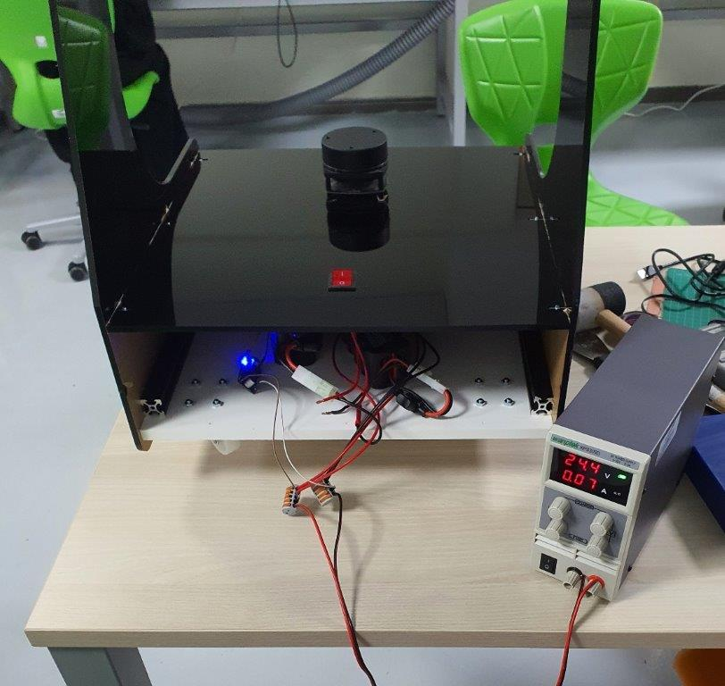
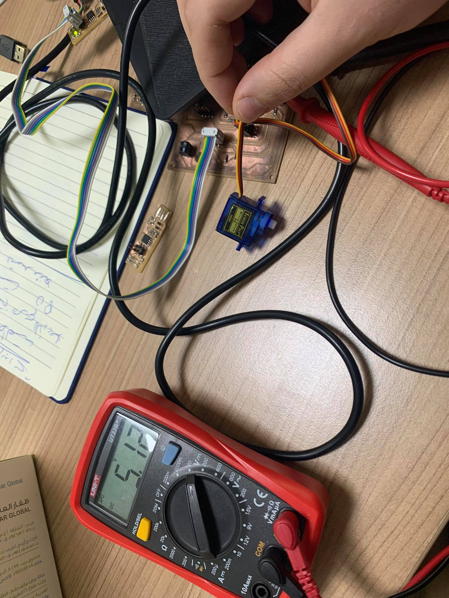
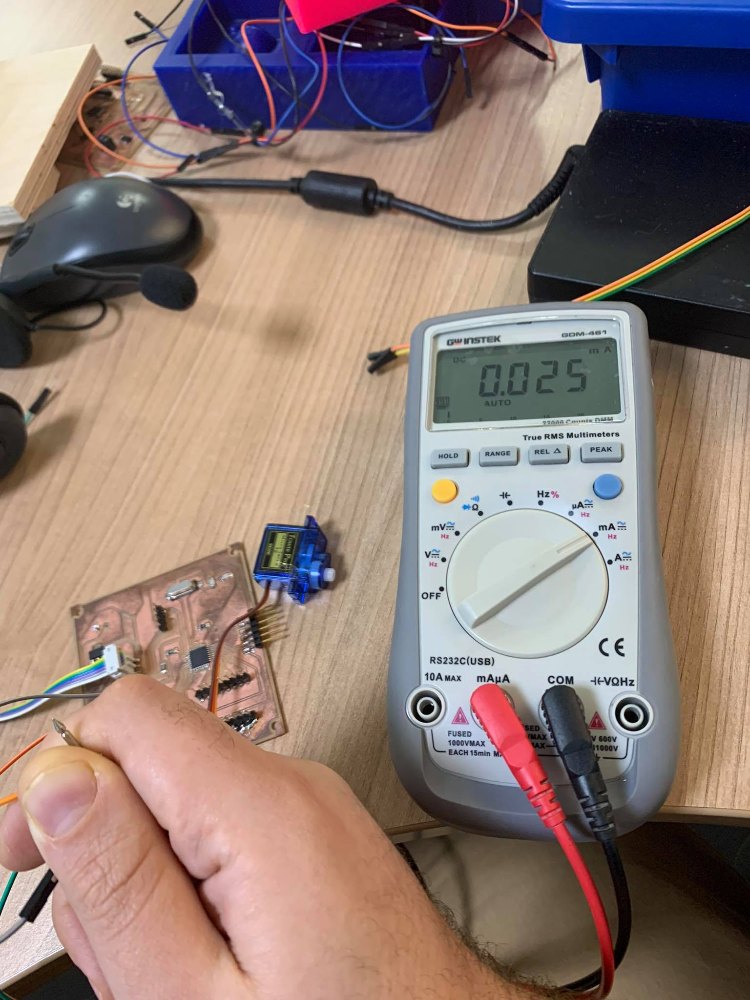
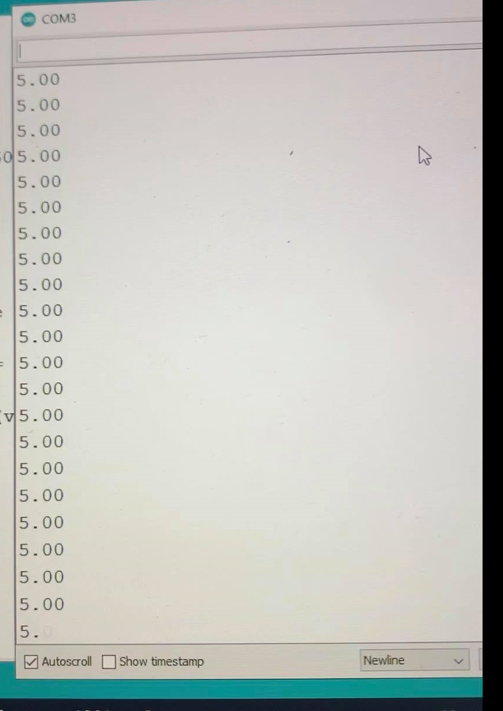

# 12. Output devices

## **Ohood Walid**

our group assignment is to measure the power consumption of our board after connecting with all the outputs. I used WANPTEK machine which is a adjustable DC voltage regulated power supply to measure my ATMEGA328P board connected with the screen, buzzer, and led.

then using this equation (P=IV):

Power = Voltage X Current

Power = 5 X 0.1

Power = 0.5 watts

<iframe width="560" height="315" src="https://www.youtube.com/embed/7Hx-hsqkNtE" title="YouTube video player" frameborder="0" allow="accelerometer; autoplay; clipboard-write; encrypted-media; gyroscope; picture-in-picture" allowfullscreen></iframe>

## **Sara Alhadhrami**

I connected the output device (DC Buzzer) to the PCB I designed and I used DC Power Supply to provide 5V to the PCB to check the current in the closed circuit. As shown in the following video, the current is 0.1A

 <iframe width="560" height="315" src="https://www.youtube.com/embed/iSKF7mFQ-7A" title="YouTube video player" frameborder="0" allow="accelerometer; autoplay; clipboard-write; encrypted-media; gyroscope; picture-in-picture" allowfullscreen></iframe>

 Then we used Digital Multimetere to measure the current and compare the two values shown on the power supply and the multimeter. As shown in the following video, the measured current equals to 0.0918A approximately and on the power supply equals to 0.09A.

<iframe width="560" height="315" src="https://www.youtube.com/embed/Osp-wMcY5Z8" title="YouTube video player" frameborder="0" allow="accelerometer; autoplay; clipboard-write; encrypted-media; gyroscope; picture-in-picture" allowfullscreen></iframe>

## **Mohammad Alshamsi**

For the Group Assignment, I'll measure the power consumption for the motor. which will be used for my final project.

I have installed Two motors in my Robot and check the current consumption.

- First test in desk without load.

  

  Power = Current x Voltage = 0.07A x 24.4V =1.708W

  Power for each motor = 1.708 / 2 = 0.854W

- Second test with load and robot moving in the floor.

  <video width="100%" controls>
  <source src="../../images/outputDevices/Mohammad/PowerWithLoad.mp4" type="video/mp4">
  Your browser does not support the video tag.
  </video>

    Power = Current x Voltage = 0.27A x 24.4V =6.588W

    Power for each motor = 6.588 / 2 = 3.294W

---------

  ##  **abdallah alsafadi**

  I measured the input voltage for the servo motor and it was 5V and the current 0.025 A.

  So the power was P=IV.
  P= 5*0.025 = 0.125 W.

  
  

  
