# 15. Mechanical design & Machine Building

### Group assignment:  

- Design a machine that includes mechanism + actuation + automation.
- Build the mechanical parts and operate it manually.
- Actuate and automate your machine.
- Document the group project and your individual contribution.

## The Ideating Process

The ideating process was relatively smooth; we held numerous meetings in-person and on Microsoft Teams discussing prospective ideas. The inital ideas ranged from 3D-printing for food, to other ideas, but then we eventually settled for our very own CNC Carving Machine. We noticed our need for one of those, and since we didn't have it available at the lab, we utilized the main objective of Fablab which is to make machines out of machines. The following is the documentation of the whole process!

**Defining the Project:** To design & build a CNC Carving Machine

<video width="100%" controls>
<source src="../../images/machine_week/machine2.mp4" type="video/mp4">
Your browser does not support the video tag.
</video>

**The project will consist of four main pillars:**

- **Design**
  - Mechanical Design
  - Electronics Design
  - Software Design
- **Fabrication**
- **Assembly**  
- **Testing**

## Mechanical Design
### X- Axis
Ohood, Alia, and Mona were in charge of the X-Axis design.

The design parts of the X axis include two aluminum profiles and two side plastic pieces that fit at one end of each by two metal rods and a NEMA17 stepper motor in the middle. The plastic pieces in white HDPE plastic were cut by using the ShopBot machine and the length was 300mm and the width was 40mm and I added a small base to make sure that there is a space for the stepper motor.
X-axis design in Fusion360
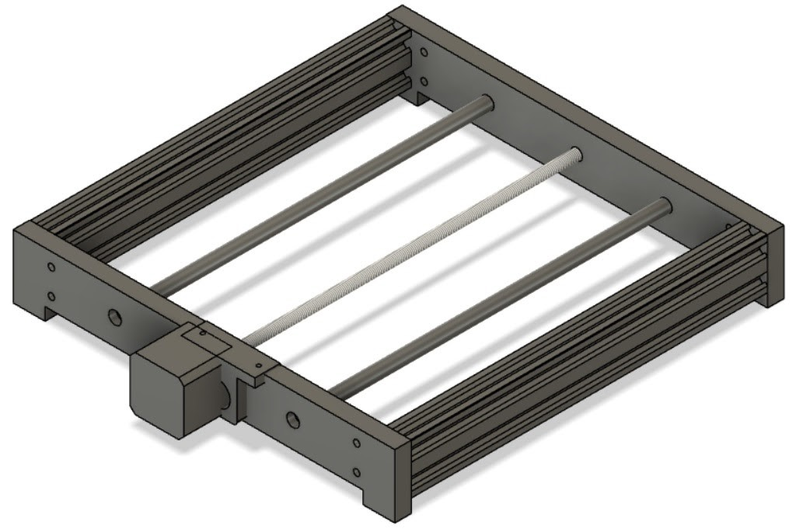

### Y- Axis
Sarah Nadir and Sara Ali were in charge of the Y-Axis design.

Y-Axis consists of two side pieces connected by using two metal rods and a NEMA17 stepper motor in the center between the rods. Metal rods and motor screw are holding Z-Axis parts. The length of each side piece is 350mm by 90mm width from the top and 150mm in the base. The distance between the sides is 300mm. Material used for the side pieces is white HDPE plastic and was cutted by using the ShopBot machine.

Image: Y-Axis design in Fusion360
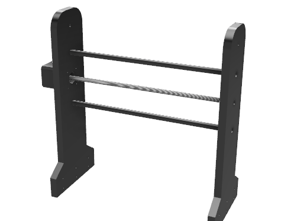

<<<<<<< HEAD
Image: Y-Axis
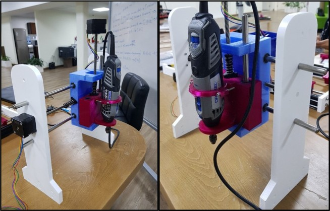

Finally we screwed the sides with the aluminum profile of the X-Axis.

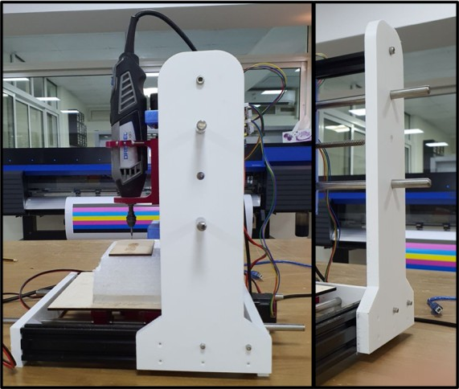
=======

### Z- Axis
Mohammed Alshamsi and Abdulla Al Safadi were in charge of the Z-Axis design.

For the z-axis design , we had two main concerns: mechanism of moving along the axis and mechanism of fixing the motor ( spindle) on the axis. The first design had the first motor we tried to use but it failed. we agreed with the y-axis team that the distance between the two holes for the linear rail will be 80 mm, and the lead screw would be in the middle. the design was like this:
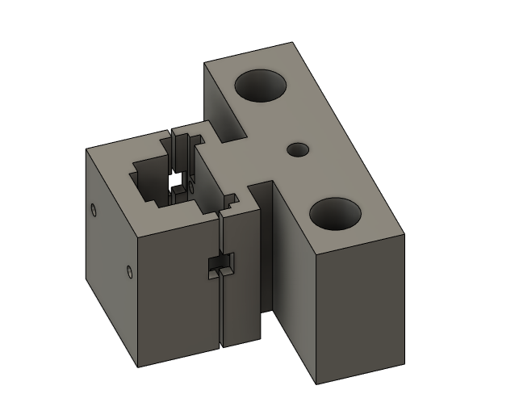

The design was made to give space for the spindle motor to fit perfectly then the cover will be screwed to tighten the hold of the motor. but since the motor failed we changed it to a dremel multi tool. We made new design and it's like this:
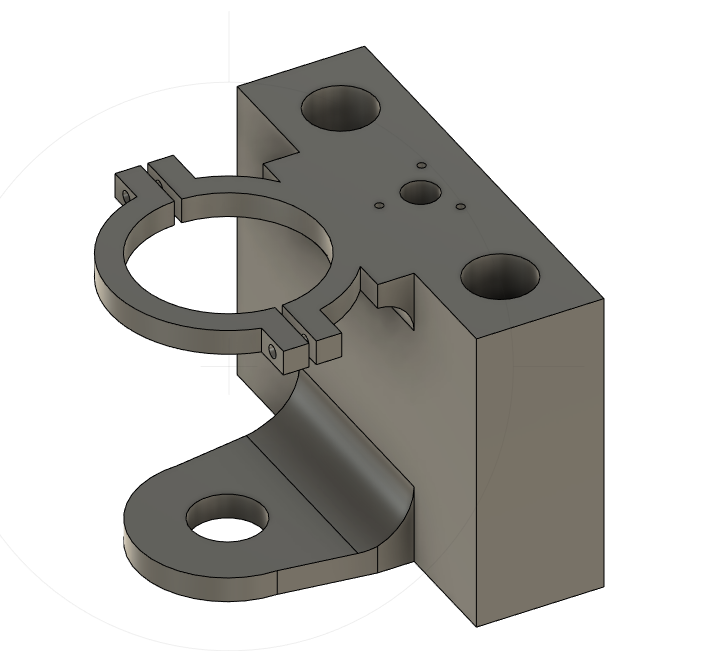

This design was better since it considered the screw holes for the anti back-lash nut. and for the dremel it had two holding points. The lower one is like a rest for the head of the dremel and fits it perfectly to restrain any movement or vibration. The upper part was designed to hold the dremel from the middle and to tighten on it with screws for a better fit. it should be mentioned that the holes design took in consideration the fact the 3d printed material will give a smaller holes that in the design which is opposite for the laser cutting.

## Electronics Design
List of electronics components used:
- NEMA17 Stepper Motors (X3)
- Stepper Motor Drivers (X3)
- Controller Board (Arduino Uno) (X1)
- CNC Shield (X1)
- Power Supply (X1)
- Dremel 300 (X1)

Our project consists of three stepper motors. One motor is used for the movement of X-Axis, one for the Y-Axis and one for the Z-Axis. Each motor is driven by one stepper motor driver. Drivers are connected to the Arduino Uno by using a CNC shield on top of the Arduino Uno. Motors are powered with a 12V generated by the power supply. And the Dremel was powered directly from electricity.

The Arduino was used to control the speed, direction of the 3 motors while they were being powered by the power supply. But the dremel was connected directly to another supply too.
This made it more complicated as we had to power the 3 motors separately from the dremel.
and the speed of the dremel was controlled directly from it, not from the software.
The connecting wires were made longer in consideration to the movement in the y-axis. This made the movement free and there was no danger of the wire getting tangled since the arduino was placed in the back on the fixed aluminium profile.

When it comes to making the right connections, we have opened each component's datasheet to make sure it's connected right in the circuit and there is no failure.

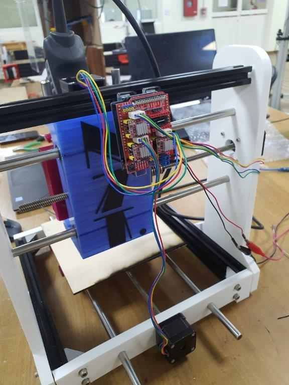

## Software Design

Sarah Nadir and Mona Bisho were in charge of the software design.

### Installing GRBL
**(April 4, 2021)**

There are many open-source CNC softwares we could've programmed our Arduino Uno to follow; however, after much research, we decided to use [GRBL](https://github.com/grbl/grbl/wiki). Following this [reference link](https://arduinoboardproject.com/en/how-to-install-grbl-on-arduino-uno-with-the-arduino-ide-software/), the steps below are what we did to download GRBL onto the Arduino Uno. This software will allow the moving of the CNC in response to the fed G code commands.

- Downloaded GRBL off the [direct link](https://github.com/grbl/grbl/archive/master.zip).

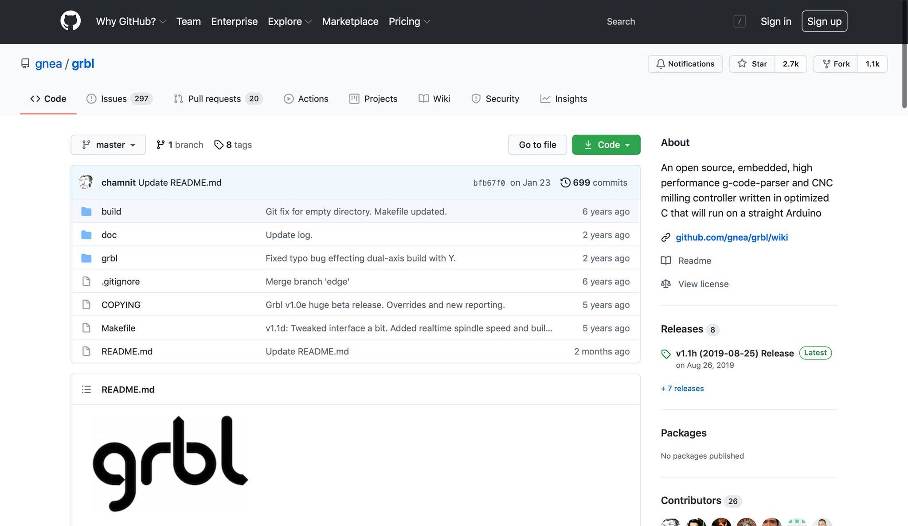

- Then, we needed to add the GRBL library to Arduino IDE. Therefore, extract the `grbl-master` folder onto your desktop from the `master.zip` file.
-  Run the Arduino IDE, and then from the bar menu choose `Sketch` -> `Include Library` -> `Add .ZIP Library`> `grbl-master` > `grbl`> `choose`.

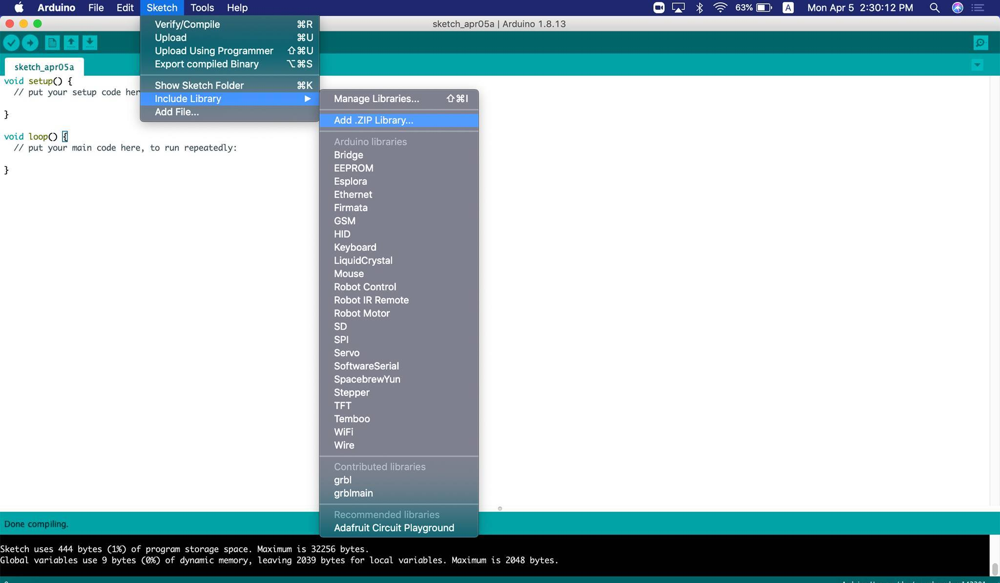

At this point the library is installed, and we have to compile and install the sketch to then upload the GRBL onto the Arduino Uno. Hence, the following steps are as follows:

- `File` -> `Open`, and select the file `grblUpload.ino` that is within `grbl-master` -> `grbl` -> `examples` -> `grblUpload`.

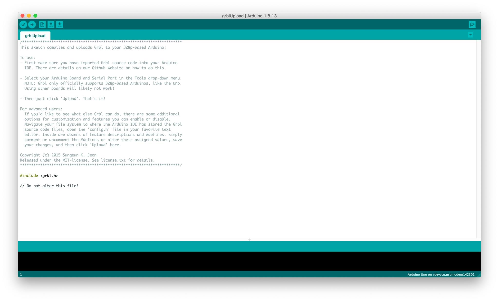

- Connect the Arduino to your computer using a USB cable.
- Click on `Upload` and wait till done.

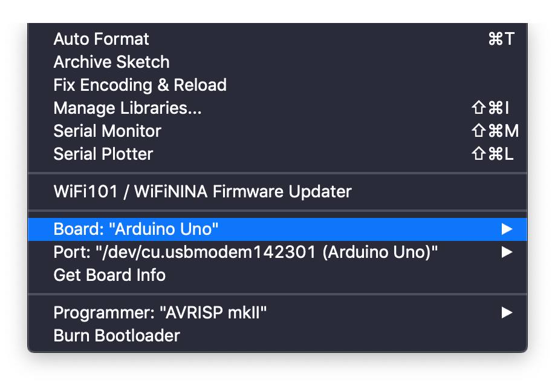

> Make sure your `Tools` settings are respective to the Arduino Uno.

**(April 5, 2021)**

The GRBL version we installed onto the Arduino Uno was an outdated version, and to keep our model up-to-date we were not going to settle for that, so we updated it. Following the steps on this [link](https://diymachining.com/diy-cnc-controller-how-to-setup-your-arduino-gshield/) we installed GRBL 0.9. The steps are similiar to the first time we installed GRBL; however first we needed to delete the old library, and add the new one.

### User Interface

**(April 4, 2021)**

Now that the Arduino Uno is programmed to welcome G-code, we wanted to test whether it can send controls to the motors. To do so, we found the [Universal Gcode Sender](https://winder.github.io/ugs_website/download/) and [Grbl Controller](https://osoyoo.com/driver/GrblController361Setup.exe.). We had trouble using the Universal Gcode Sender, so we resorted to the Grbl Controller which was much easier and more user-friendly.
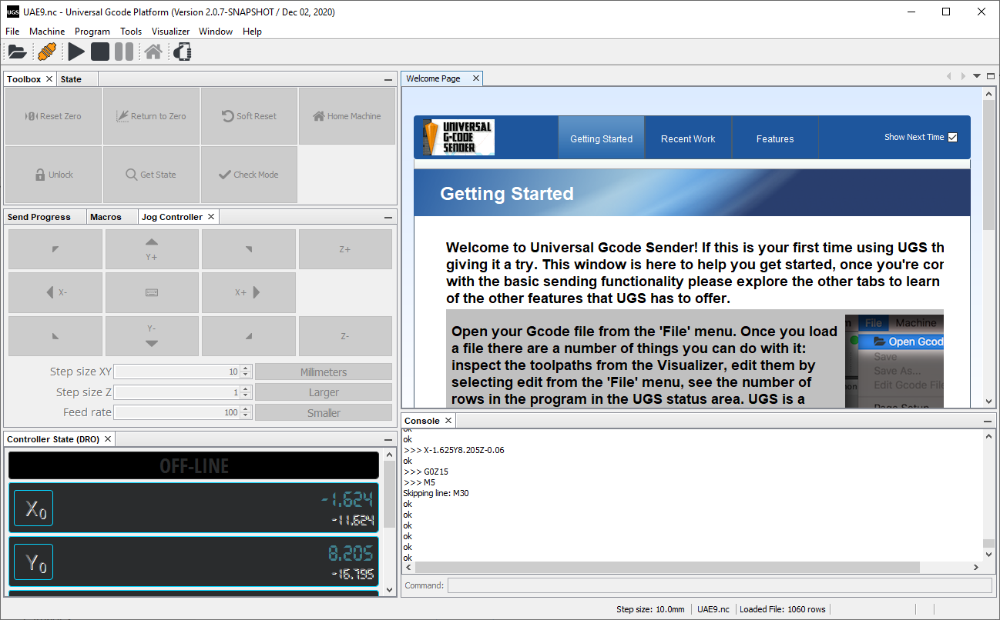

Upon launching the Grbl Controller, we chose the port COM4, and made sure the baude rate is at 9600 because the GRBL version we installed on the Arduino Uno would only respond to that. After that, clicked on `open` and then we controlled the machine using the movement buttons on the interface, and we were able to move the motors successfully.

**(April 5, 2021)**

The next step was to add limits to the model, but we had to skip that step as we were short on limit switches in the lab. We also decided that the GRBL controller, although our favorite in the beginning, didn't offer much options for control, so we resorted back to the UGS. We downloaded an updated version (1.0.9), and installed the lastest Java version, for the UGS is a Java based software.

The steps to setup the UGS with your controller are as follows:

1. Launch the application and connect your controller (in our case the Arduino Uno) to the computer.
2. Set the Firmware to `GRBL`, choose the correct port from the drop-down menu.
3. Set the baude rate to `115200` so it corresponds to the new version of GRBL.
4. `Machine`> `Setup wizard`> and follow the steps according to your model.

## Fabrication

### Fabrication of z-axis
the design for the z-axis spindle holder was printed first by a zortrax printer and it looked like this:  
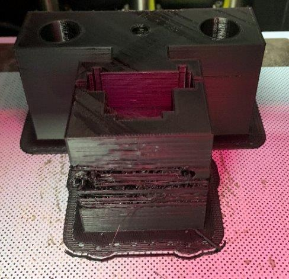

It failed due to the cold room temperature. and since we changed the design for the new motor, we used an ultimaker printer with PLA for the main part and PVA for support. and it looked like this:  
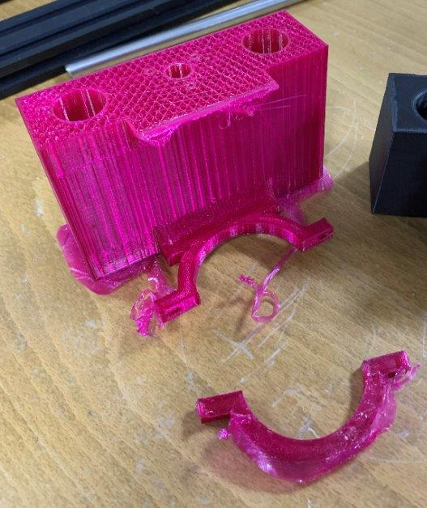

The PVA support was stuck in the nozzle so it ruined the whole printed part. so next print we used PLA as a support from the same nozzle and it worked the result was like this:
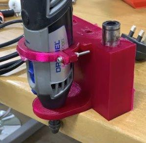

### Fabrication of Y-Axis:
We used the ShopBot machine to cut the white HDPE plastic for the side pieces. We used a 3mm drilling bit to grave holes for the 3mm screws. In addition, we used a 6mm drilling bit to cut the outline and to grave all the holes that are equal to 6mm in diameter and more than 6mm.
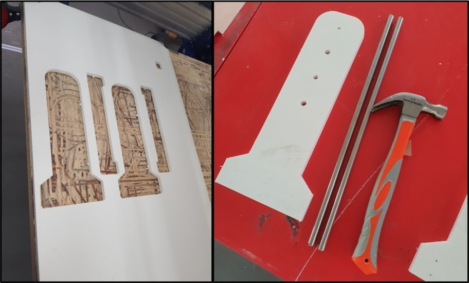

### Fabrication of X-Axis:

We 3D printed the linear rail shaft supports
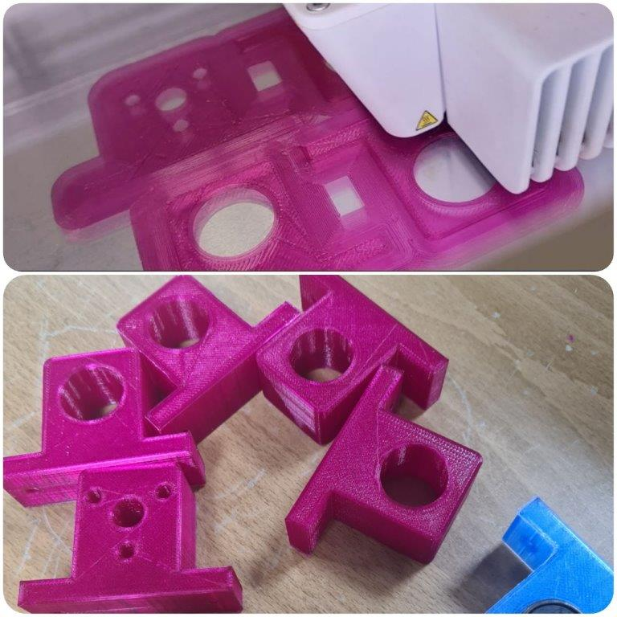

Then cutting the bed sheet using 3mm MDF sheet with Universal Laser PLS6MW Laser, settings the power= 100%, speed=2.6%, PPI=300
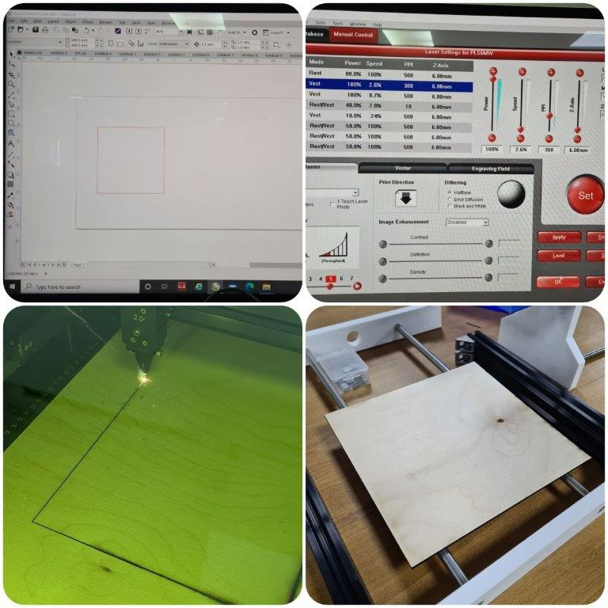

## Assembly

### Mechanical Assembly
#### Assembly of z-axis:
 First we added the ball bearing to the holes which are made for the linear rail. they were a tight fit. Then we added the anti back-lash nut then fixed the 3d printed part to the y-axis using the linear rail then added the lead screw which is attached to the z-axis motor. Then eventually we added the dremel spindle and tightened it to the 3d printed holder. the result was like this:
 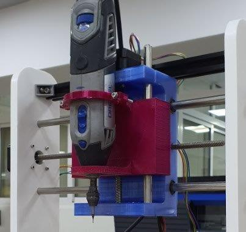

#### Assembly of Y-Axis:
We used the hammer to insert the rods in one of the side pieces then we inserted the NEMA17 stepper motor between the rods and we fixed it by using 3mm screws. After that we inserted the Z-Axis parts and again used the hammer to fix the other side piece. At the top of the rods we used a 300mm aluminum profile for stabilization. And in the base we used a 3mm screws to fix the side pieces with the aluminum profile of the X-Axis.

#### Assembly of X-Axis:
There was the process of screwing and assembling all the designed elements of X-Axis together.
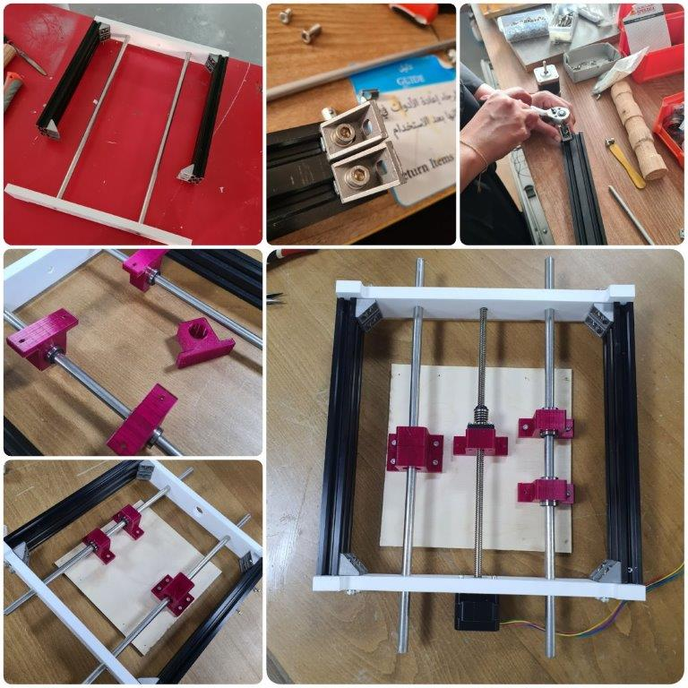

#### Final
Here is our CNC machine after  fully assembly
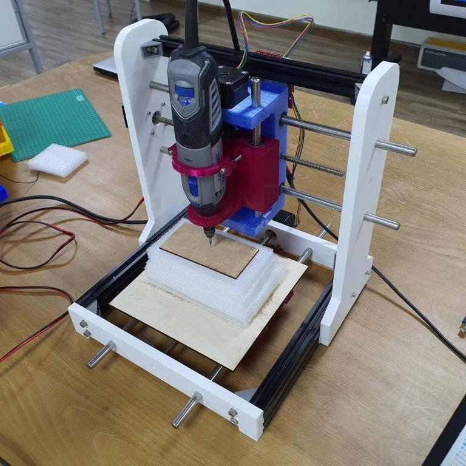

## Issues Faced + Solutions
 - With regards to **software design**, we had trouble getting the user interface (UGS) connected to the Arduino Uno. So, we updated the GRBL version installed onto the Arduino Uno, the Java on the computer, and the UGS to the latest versions, and it worked!

## Areas for Further Improvement

- Introducing limits by implementing limit switches.

## Design Files
[Final Assembly Fusion File](../files/w15/CNCAssemblyv15.f3z)

[Machine design in STL File](../files/CNC_Assembly.stl)  
