# 16. Interface and application programming

## **Processing** (Ohood Walid)

[Processing](https://processing.org) is programe that help the programmer to interact with electronic devices through image icons not by using a text command. The widgets of the interface are selected to lunch actions as wanted that allows structures within which the interface is linked to application functions such as Processing.

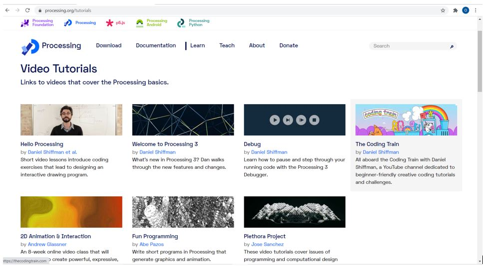{width="80%"}

I write the code in Processing as shown below

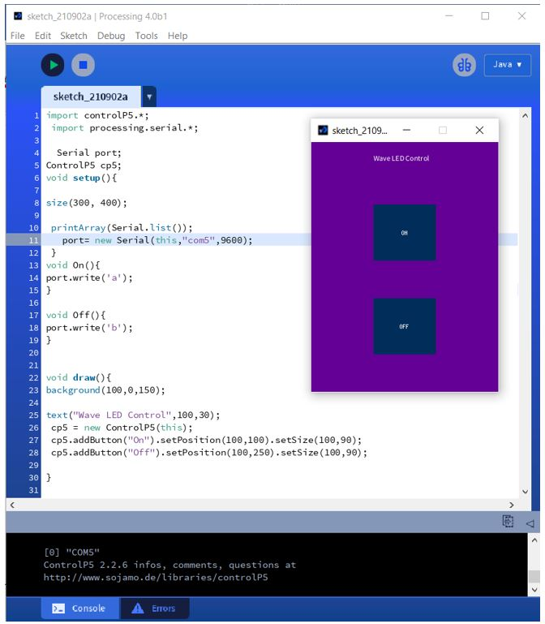{width="80%"}

Then I write the Arduino code & connect it with the Processing

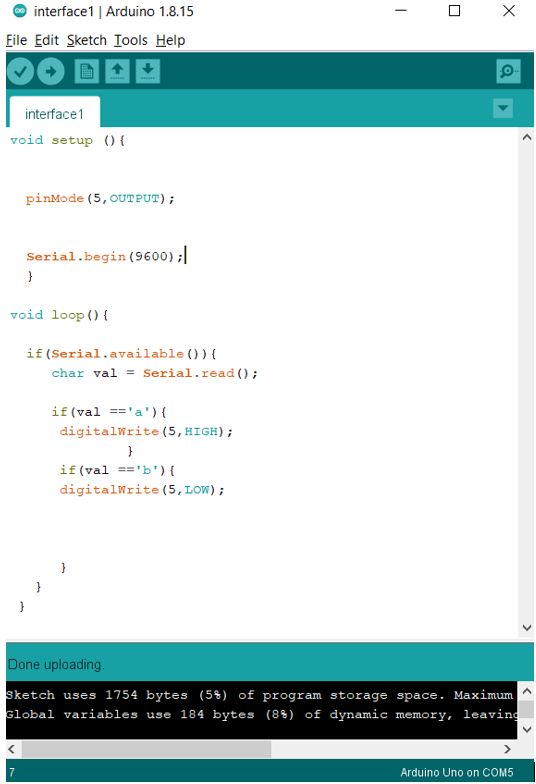{width="80%"}

**video of using Processing**

<iframe width="560" height="315" src="https://www.youtube.com/embed/iHXC1xu9ka4" title="YouTube video player" frameborder="0" allow="accelerometer; autoplay; clipboard-write; encrypted-media; gyroscope; picture-in-picture" allowfullscreen></iframe>

**What I like:**

•simplicity of making visual widgets using code

•free open-source

•flexible programming language to code

•easy to learn & use

•using visual arts interacting with Arduino IDE

## **MIT APP Inventor** (Sara Alhadhrami)

[MIT App Inventor](https://appinventor.mit.edu/) is a visual programming environment that allows everyone to build fully functional apps
for Android and iOS smartphones and tablets.

I designed an application that interfaces with the Ultrasonic sensor in my [Final Project](final.html).

The following images shows the blocks code and the design of my mobile application.

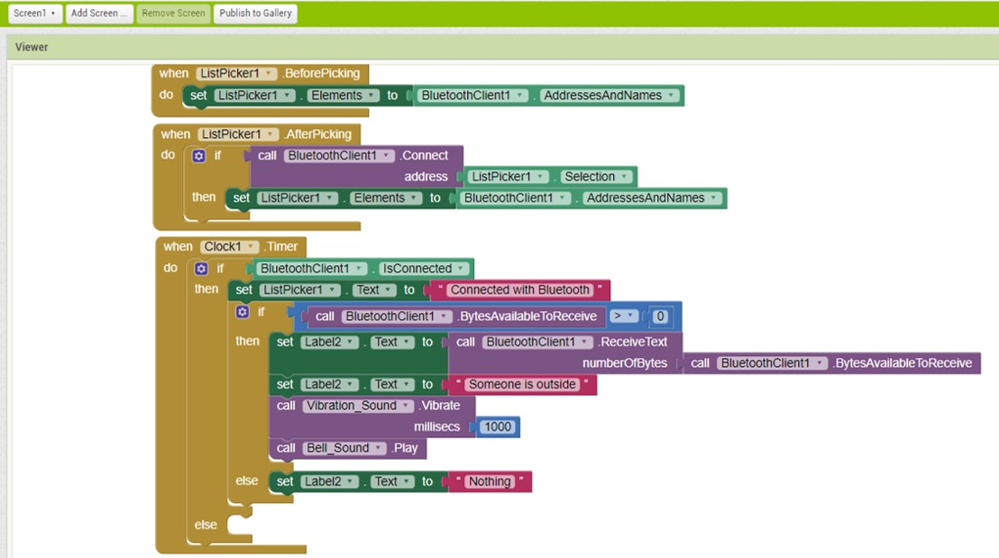

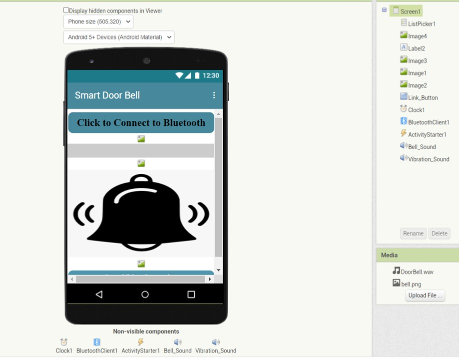

Then I wrote the following code and I upload it to my esp32cam microcontroller to allow the communication between the PCB and the app.

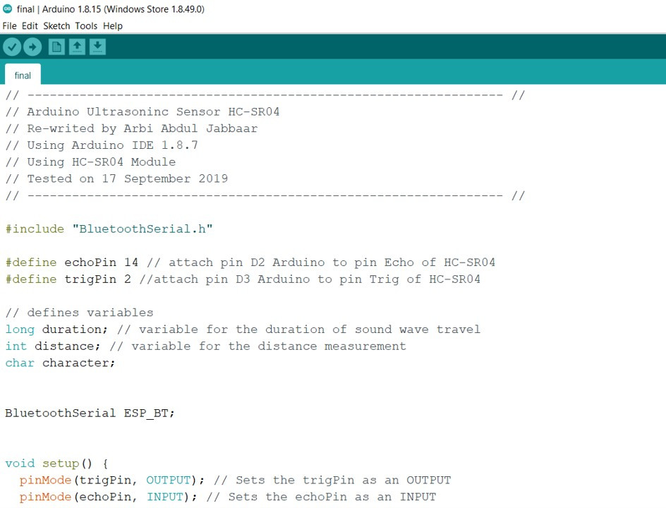
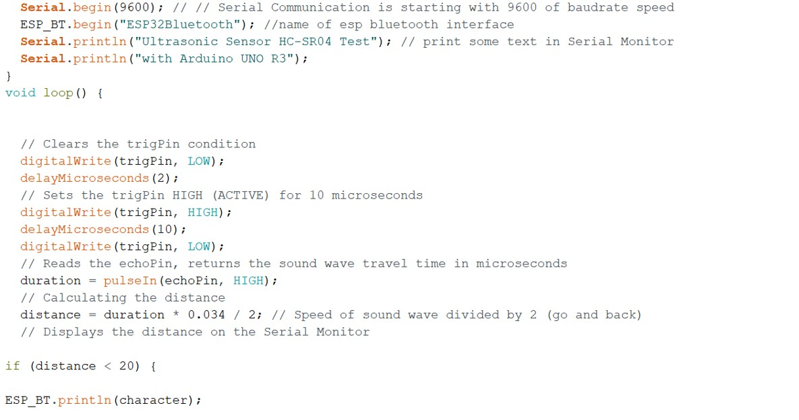
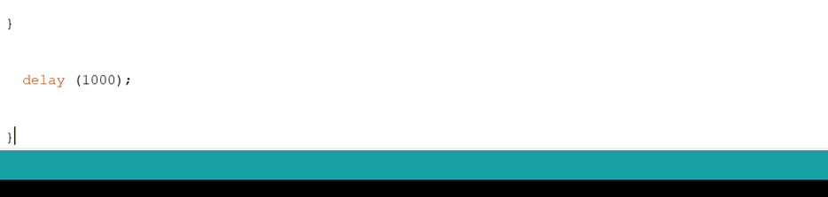

The following video shows how the application works with my smart doorbell project.

<iframe width="660" height="415" src="https://www.youtube.com/embed/hBtEYXxDfkk" title="YouTube video player" frameborder="0" allow="accelerometer; autoplay; clipboard-write; encrypted-media; gyroscope; picture-in-picture" allowfullscreen></iframe>

## Tkinter Programming (Mohammad Alshamsi)

Tkinter is the standard graphical user interface (GUI) library for Python. which provides a fast and easy way to create graphical user interface (GUI) applications. Tkinter provides a powerful object-oriented interface to the Tk GUI toolkit

For more  detail about tkinter package please check  [docs.python.org](https://docs.python.org/3/library/tkinter.html)

The Following Code will show how will use tkinter package to program an interface
~~~python
## Import tkinter library
from tkinter  import *
import tkinter.font
from time import sleep

# open new Window
win = Tk()

# Set window Title
win.title("Motor Control")  

# Set font format
myFont = tkinter.font.Font(family = "Helvetica", size =12, weight = "bold")  

# Button Function
def ledToggle():
    if ledButton["text"] == "Turn Motor off":
        ledButton["text"] = "Turn Motor ON"
    else:
        ledButton["text"]= "Turn Motor off"

# Close Button Function          
def close():
    win.destroy()

# Slider Function
def speed(val):
    val = float(val)
    if val <0:
        val = abs(val)
        selection = "Backward = " + str(val)
    elif val >0:
        selection = "Forward = " + str(val)
    else:
        selection = "Stop"

    label.config(text = selection)    
    sleep(0.01)

# Create Button
ledButton = Button(win, text="Turn Motor ON", font=myFont, command=ledToggle, bg="bisque2", height=1, width=24)
ledButton.grid(row=0,column=1)

# Create Slider
var = DoubleVar()
speedScale = Scale(win, from_=-0.5, to=0.5, resolution = 0.05, variable = var, command = speed, orient=HORIZONTAL, length = 500, width = 50 )
speedScale.grid(row=1,column=1)

# Create Lable
label = Label(win)
label.grid(row=2, column = 1)

# Create Exit Button
exitButton = Button (win,text = "Exit", font = myFont, command = close, bg = "red", height = 1, width = 10)
exitButton.grid(row=10,column=1)

win.protocol("WM_DELETE_WINDOW", close)
win.mainloop()
~~~

You can download and test the code from [here](../images/ApplicationProgramming/InterfaceDesign.py)

Run the python code and you should got the following screen

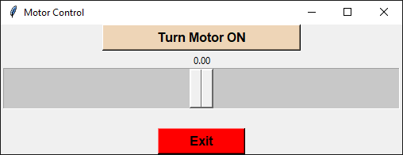

- You can download the full python code from [here](../images/interface/Mohammad/Arduino_Control_GUI_Fab.py)

- Run the python code   
  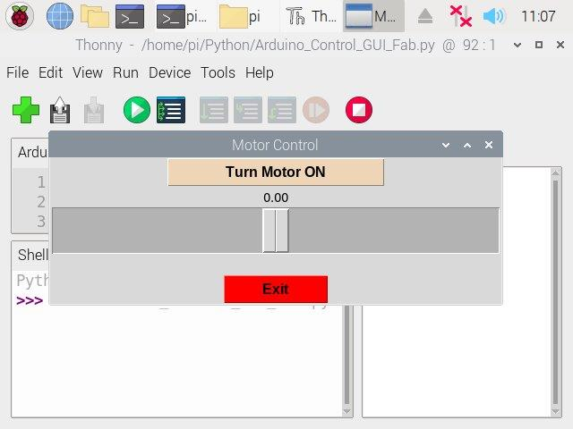

- Click on Turn Motor ON and move the slider to control the motor speed and direction
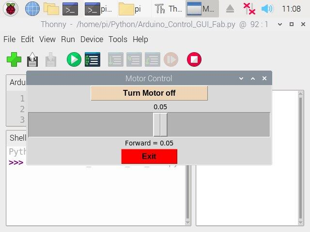

This is how it works:

<video width="100%" controls>
  <source src="../../images/interface/Mohammad/Output.mp4" type="video/mp4">
Your browser does not support the video tag.
</video>

** Abdallah Alsafadi**

### Processing :

#### Brief:  ​

Processing is a flexible software sketchbook and a language for learning how to code within the context of the visual arts. ​

#### Advantages: ​

Free to download and open source.
​ - For GNU/Linux, Mac OS X, Windows, Android, and ARM.

​ - Interactive programs with 2D, 3D, PDF, or SVG output. ​

Well documented, with many books and tutorials available.
​ - Used easily with Arduino and Attiny44 from our experience.

Able to create complex shapes and art using lines of codes. ​
Disadvantages ? ​

It is a programming language, meaning that it is low level.

## Experience.

the interface was easy to use for a beginner and easy to connect to the Arduino code. I used JAVASCRIPT before it  was easy for me to understand the processing code. the visual arts seem to need to be more development I the software. but I can give them a high rate of the east to use software.
